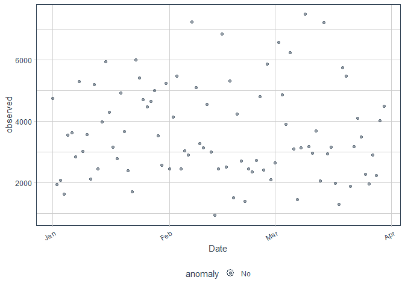

R Notebook
================

``` r
data <- read.csv("http://bit.ly/CarreFourSalesDataset")
head(data)
```

    ##        Date    Sales
    ## 1  1/5/2019 548.9715
    ## 2  3/8/2019  80.2200
    ## 3  3/3/2019 340.5255
    ## 4 1/27/2019 489.0480
    ## 5  2/8/2019 634.3785
    ## 6 3/25/2019 627.6165

``` r
summary(data)
```

    ##      Date               Sales        
    ##  Length:1000        Min.   :  10.68  
    ##  Class :character   1st Qu.: 124.42  
    ##  Mode  :character   Median : 253.85  
    ##                     Mean   : 322.97  
    ##                     3rd Qu.: 471.35  
    ##                     Max.   :1042.65

``` r
duplicated_rows <- data[duplicated(data),]
nrow(duplicated_rows)
```

    ## [1] 0

``` r
data <- data[!duplicated(data), ]
duplicated_rows <- data[duplicated(data),]
nrow(duplicated_rows)
```

    ## [1] 0

``` r
colSums(is.na(data))
```

    ##  Date Sales 
    ##     0     0

``` r
data <- data[order(data$Date),]
```

``` r
data <- aggregate(list(Sales=data$Sales), by=list(Date=data$Date), FUN=sum)
head(data)
```

    ##        Date    Sales
    ## 1  1/1/2019 4745.181
    ## 2 1/10/2019 3560.949
    ## 3 1/11/2019 2114.963
    ## 4 1/12/2019 5184.764
    ## 5 1/13/2019 2451.204
    ## 6 1/14/2019 3966.617

``` r
#data <- as.data.frame(data)
head(data)
```

    ##        Date    Sales
    ## 1  1/1/2019 4745.181
    ## 2 1/10/2019 3560.949
    ## 3 1/11/2019 2114.963
    ## 4 1/12/2019 5184.764
    ## 5 1/13/2019 2451.204
    ## 6 1/14/2019 3966.617

``` r
#install.packages("devtools")

#devtools::install_github("tidyverse/lubridate")
```

``` r
library(usethis)
library(devtools)
library(lubridate)
```

    ## 
    ## Attaching package: 'lubridate'

    ## The following objects are masked from 'package:base':
    ## 
    ##     date, intersect, setdiff, union

``` r
data$Date <- mdy(data$Date)
head(data)
```

    ##         Date    Sales
    ## 1 2019-01-01 4745.181
    ## 2 2019-01-10 3560.949
    ## 3 2019-01-11 2114.963
    ## 4 2019-01-12 5184.764
    ## 5 2019-01-13 2451.204
    ## 6 2019-01-14 3966.617

``` r
#install.packages("anomalize")
```

``` r
library(tidyverse)
```

    ## -- Attaching packages --------------------------------------- tidyverse 1.3.0 --

    ## v ggplot2 3.3.3     v purrr   0.3.4
    ## v tibble  3.0.5     v dplyr   1.0.3
    ## v tidyr   1.1.2     v stringr 1.4.0
    ## v readr   1.4.0     v forcats 0.5.0

    ## -- Conflicts ------------------------------------------ tidyverse_conflicts() --
    ## x lubridate::as.difftime() masks base::as.difftime()
    ## x lubridate::date()        masks base::date()
    ## x dplyr::filter()          masks stats::filter()
    ## x lubridate::intersect()   masks base::intersect()
    ## x dplyr::lag()             masks stats::lag()
    ## x lubridate::setdiff()     masks base::setdiff()
    ## x lubridate::union()       masks base::union()

``` r
library(tibbletime)
```

    ## 
    ## Attaching package: 'tibbletime'

    ## The following object is masked from 'package:stats':
    ## 
    ##     filter

``` r
library(anomalize)
```

    ## == Use anomalize to improve your Forecasts by 50%! =============================
    ## Business Science offers a 1-hour course - Lab #18: Time Series Anomaly Detection!
    ## </> Learn more at: https://university.business-science.io/p/learning-labs-pro </>

``` r
data <- tbl_time(data, index=Date)
head(data)
```

    ## # A time tibble: 6 x 2
    ## # Index: Date
    ##   Date       Sales
    ##   <date>     <dbl>
    ## 1 2019-01-01 4745.
    ## 2 2019-01-10 3561.
    ## 3 2019-01-11 2115.
    ## 4 2019-01-12 5185.
    ## 5 2019-01-13 2451.
    ## 6 2019-01-14 3967.

``` r
data %>% 
  time_decompose(Sales) %>%
  anomalize(remainder) %>% 
  plot_anomalies(alpha_dots = 0.5)
```

    ## Note: Index not ordered. tibbletime assumes index is in ascending order. Results may not be as desired.

    ## frequency = 7 days

    ## Note: Index not ordered. tibbletime assumes index is in ascending order. Results may not be as desired.
    ## Note: Index not ordered. tibbletime assumes index is in ascending order. Results may not be as desired.

    ## trend = 30 days

    ## Registered S3 method overwritten by 'quantmod':
    ##   method            from
    ##   as.zoo.data.frame zoo

<!-- -->
