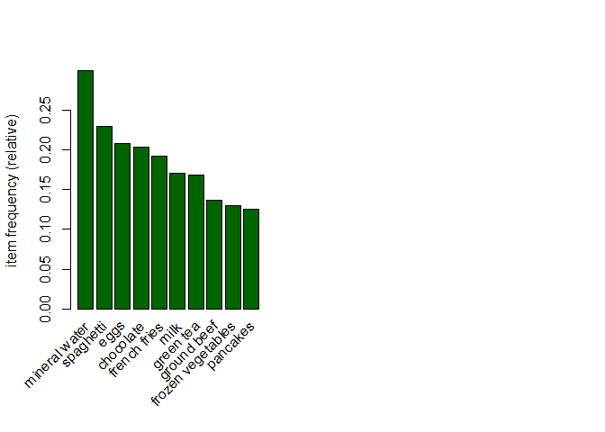

R Notebook
================

``` r
# install.packages("arules")
```

``` r
library(arules)
```

    ## Loading required package: Matrix

    ## 
    ## Attaching package: 'arules'

    ## The following objects are masked from 'package:base':
    ## 
    ##     abbreviate, write

``` r
path <- "http://bit.ly/SupermarketDatasetII"
transactions<-read.transactions(path, sep = ",")
```

    ## Warning in asMethod(object): removing duplicated items in transactions

``` r
transactions
```

    ## transactions in sparse format with
    ##  7501 transactions (rows) and
    ##  119 items (columns)

``` r
duplicated_rows <- transactions[duplicated(transactions),]
nrow(duplicated_rows)
```

    ## [1] 2347

``` r
transactions <- transactions[!duplicated(transactions), ]
duplicated_rows <- transactions[duplicated(transactions),]
nrow(duplicated_rows)
```

    ## [1] 0

``` r
class(transactions)
```

    ## [1] "transactions"
    ## attr(,"package")
    ## [1] "arules"

``` r
inspect(transactions[1:5])
```

    ##     items              
    ## [1] {almonds,          
    ##      antioxydant juice,
    ##      avocado,          
    ##      cottage cheese,   
    ##      energy drink,     
    ##      frozen smoothie,  
    ##      green grapes,     
    ##      green tea,        
    ##      honey,            
    ##      low fat yogurt,   
    ##      mineral water,    
    ##      olive oil,        
    ##      salad,            
    ##      salmon,           
    ##      shrimp,           
    ##      spinach,          
    ##      tomato juice,     
    ##      vegetables mix,   
    ##      whole weat flour, 
    ##      yams}             
    ## [2] {burgers,          
    ##      eggs,             
    ##      meatballs}        
    ## [3] {chutney}          
    ## [4] {avocado,          
    ##      turkey}           
    ## [5] {energy bar,       
    ##      green tea,        
    ##      milk,             
    ##      mineral water,    
    ##      whole wheat rice}

``` r
summary(transactions)
```

    ## transactions as itemMatrix in sparse format with
    ##  5154 rows (elements/itemsets/transactions) and
    ##  119 columns (items) and a density of 0.04272605 
    ## 
    ## most frequent items:
    ## mineral water     spaghetti          eggs     chocolate  french fries 
    ##          1546          1186          1072          1050           994 
    ##       (Other) 
    ##         20357 
    ## 
    ## element (itemset/transaction) length distribution:
    ## sizes
    ##   1   2   3   4   5   6   7   8   9  10  11  12  13  14  15  16  18  19  20 
    ## 110 744 969 802 667 493 391 324 259 139 102  67  40  22  17   4   1   2   1 
    ## 
    ##    Min. 1st Qu.  Median    Mean 3rd Qu.    Max. 
    ##   1.000   3.000   4.000   5.084   7.000  20.000 
    ## 
    ## includes extended item information - examples:
    ##              labels
    ## 1           almonds
    ## 2 antioxydant juice
    ## 3         asparagus

``` r
par(mfrow = c(1, 2))

# plot the frequency of items
itemFrequencyPlot(transactions, topN = 10, col="darkgreen")
```

<!-- -->

``` r
rules <- apriori (transactions, parameter = list(supp = 0.001, conf = 0.8))
```

    ## Apriori
    ## 
    ## Parameter specification:
    ##  confidence minval smax arem  aval originalSupport maxtime support minlen
    ##         0.8    0.1    1 none FALSE            TRUE       5   0.001      1
    ##  maxlen target  ext
    ##      10  rules TRUE
    ## 
    ## Algorithmic control:
    ##  filter tree heap memopt load sort verbose
    ##     0.1 TRUE TRUE  FALSE TRUE    2    TRUE
    ## 
    ## Absolute minimum support count: 5 
    ## 
    ## set item appearances ...[0 item(s)] done [0.00s].
    ## set transactions ...[119 item(s), 5154 transaction(s)] done [0.00s].
    ## sorting and recoding items ... [117 item(s)] done [0.00s].
    ## creating transaction tree ... done [0.00s].
    ## checking subsets of size 1 2 3 4 5 6 done [0.01s].
    ## writing ... [247 rule(s)] done [0.00s].
    ## creating S4 object  ... done [0.00s].

``` r
rules
```

    ## set of 247 rules

``` r
summary(rules)
```

    ## set of 247 rules
    ## 
    ## rule length distribution (lhs + rhs):sizes
    ##   3   4   5   6 
    ##  28 125  91   3 
    ## 
    ##    Min. 1st Qu.  Median    Mean 3rd Qu.    Max. 
    ##   3.000   4.000   4.000   4.279   5.000   6.000 
    ## 
    ## summary of quality measures:
    ##     support           confidence        coverage             lift       
    ##  Min.   :0.001164   Min.   :0.8000   Min.   :0.001164   Min.   : 2.667  
    ##  1st Qu.:0.001164   1st Qu.:0.8571   1st Qu.:0.001358   1st Qu.: 2.858  
    ##  Median :0.001164   Median :0.8571   Median :0.001358   Median : 3.477  
    ##  Mean   :0.001391   Mean   :0.8790   Mean   :0.001595   Mean   : 3.866  
    ##  3rd Qu.:0.001552   3rd Qu.:0.8819   3rd Qu.:0.001746   3rd Qu.: 4.177  
    ##  Max.   :0.003104   Max.   :1.0000   Max.   :0.003686   Max.   :14.501  
    ##      count      
    ##  Min.   : 6.00  
    ##  1st Qu.: 6.00  
    ##  Median : 6.00  
    ##  Mean   : 7.17  
    ##  3rd Qu.: 8.00  
    ##  Max.   :16.00  
    ## 
    ## mining info:
    ##          data ntransactions support confidence
    ##  transactions          5154   0.001        0.8

``` r
inspect(rules[1:5])
```

    ##     lhs                           rhs             support     confidence
    ## [1] {burgers,hand protein bar} => {mineral water} 0.001164144 0.8571429 
    ## [2] {chili,escalope}           => {mineral water} 0.001164144 0.8571429 
    ## [3] {frozen smoothie,spinach}  => {mineral water} 0.001552192 0.8888889 
    ## [4] {shrimp,strong cheese}     => {mineral water} 0.001358168 0.8750000 
    ## [5] {green beans,tomatoes}     => {spaghetti}     0.001164144 0.8571429 
    ##     coverage    lift     count
    ## [1] 0.001358168 2.857512 6    
    ## [2] 0.001358168 2.857512 6    
    ## [3] 0.001746217 2.963346 8    
    ## [4] 0.001552192 2.917044 7    
    ## [5] 0.001358168 3.724886 6

``` r
rules<-sort(rules, by="confidence", decreasing=TRUE)
inspect(rules[1:5])
```

    ##     lhs                    rhs                 support confidence    coverage     lift count
    ## [1] {nonfat milk,                                                                           
    ##      soup}              => {mineral water} 0.001164144          1 0.001164144 3.333765     6
    ## [2] {nonfat milk,                                                                           
    ##      spaghetti,                                                                             
    ##      tomatoes}          => {mineral water} 0.001164144          1 0.001164144 3.333765     6
    ## [3] {frozen vegetables,                                                                     
    ##      nonfat milk,                                                                           
    ##      spaghetti}         => {mineral water} 0.001164144          1 0.001164144 3.333765     6
    ## [4] {ground beef,                                                                           
    ##      milk,                                                                                  
    ##      nonfat milk}       => {mineral water} 0.001358168          1 0.001358168 3.333765     7
    ## [5] {ground beef,                                                                           
    ##      light cream,                                                                           
    ##      olive oil}         => {mineral water} 0.001746217          1 0.001746217 3.333765     9

``` r
# Subset the rules
spaghetti <- subset(rules, subset = lhs %pin% "spaghetti")

# Order by confidence
spaghetti<-sort(spaghetti, by="confidence", decreasing=TRUE)

# inspect top 5
inspect(spaghetti[15:19])
```

    ##     lhs                    rhs                 support confidence    coverage     lift count
    ## [1] {herb & pepper,                                                                         
    ##      mineral water,                                                                         
    ##      shrimp,                                                                                
    ##      spaghetti}         => {ground beef}   0.001358168      0.875 0.001552192 6.415007     7
    ## [2] {eggs,                                                                                  
    ##      frozen vegetables,                                                                     
    ##      herb & pepper,                                                                         
    ##      spaghetti}         => {mineral water} 0.001358168      0.875 0.001552192 2.917044     7
    ## [3] {frozen smoothie,                                                                       
    ##      milk,                                                                                  
    ##      shrimp,                                                                                
    ##      spaghetti}         => {mineral water} 0.001358168      0.875 0.001552192 2.917044     7
    ## [4] {chicken,                                                                               
    ##      olive oil,                                                                             
    ##      shrimp,                                                                                
    ##      spaghetti}         => {mineral water} 0.001358168      0.875 0.001552192 2.917044     7
    ## [5] {chicken,                                                                               
    ##      chocolate,                                                                             
    ##      shrimp,                                                                                
    ##      spaghetti}         => {mineral water} 0.001358168      0.875 0.001552192 2.917044     7
