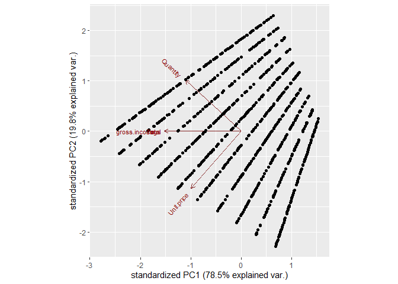
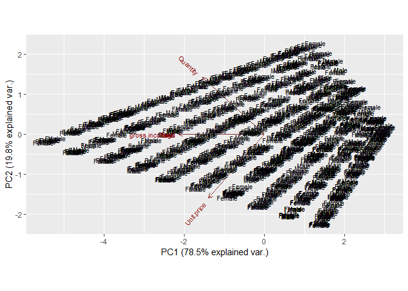
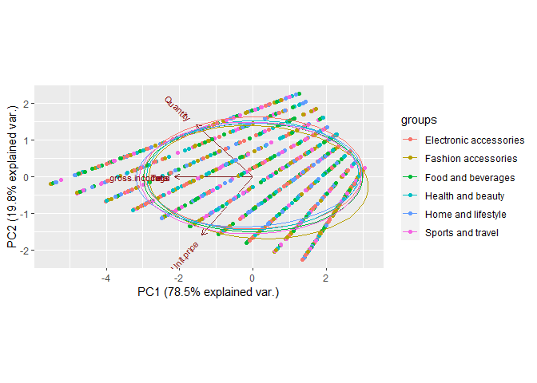

R Notebook
================

``` r
data <- read.csv("http://bit.ly/CarreFourDataset")
head(data)
```

    ##    Invoice.ID Branch Customer.type Gender           Product.line Unit.price
    ## 1 750-67-8428      A        Member Female      Health and beauty      74.69
    ## 2 226-31-3081      C        Normal Female Electronic accessories      15.28
    ## 3 631-41-3108      A        Normal   Male     Home and lifestyle      46.33
    ## 4 123-19-1176      A        Member   Male      Health and beauty      58.22
    ## 5 373-73-7910      A        Normal   Male      Sports and travel      86.31
    ## 6 699-14-3026      C        Normal   Male Electronic accessories      85.39
    ##   Quantity     Tax      Date  Time     Payment   cogs gross.margin.percentage
    ## 1        7 26.1415  1/5/2019 13:08     Ewallet 522.83                4.761905
    ## 2        5  3.8200  3/8/2019 10:29        Cash  76.40                4.761905
    ## 3        7 16.2155  3/3/2019 13:23 Credit card 324.31                4.761905
    ## 4        8 23.2880 1/27/2019 20:33     Ewallet 465.76                4.761905
    ## 5        7 30.2085  2/8/2019 10:37     Ewallet 604.17                4.761905
    ## 6        7 29.8865 3/25/2019 18:30     Ewallet 597.73                4.761905
    ##   gross.income Rating    Total
    ## 1      26.1415    9.1 548.9715
    ## 2       3.8200    9.6  80.2200
    ## 3      16.2155    7.4 340.5255
    ## 4      23.2880    8.4 489.0480
    ## 5      30.2085    5.3 634.3785
    ## 6      29.8865    4.1 627.6165

``` r
data = subset(data, select = -c(Invoice.ID) )
head(data)
```

    ##   Branch Customer.type Gender           Product.line Unit.price Quantity
    ## 1      A        Member Female      Health and beauty      74.69        7
    ## 2      C        Normal Female Electronic accessories      15.28        5
    ## 3      A        Normal   Male     Home and lifestyle      46.33        7
    ## 4      A        Member   Male      Health and beauty      58.22        8
    ## 5      A        Normal   Male      Sports and travel      86.31        7
    ## 6      C        Normal   Male Electronic accessories      85.39        7
    ##       Tax      Date  Time     Payment   cogs gross.margin.percentage
    ## 1 26.1415  1/5/2019 13:08     Ewallet 522.83                4.761905
    ## 2  3.8200  3/8/2019 10:29        Cash  76.40                4.761905
    ## 3 16.2155  3/3/2019 13:23 Credit card 324.31                4.761905
    ## 4 23.2880 1/27/2019 20:33     Ewallet 465.76                4.761905
    ## 5 30.2085  2/8/2019 10:37     Ewallet 604.17                4.761905
    ## 6 29.8865 3/25/2019 18:30     Ewallet 597.73                4.761905
    ##   gross.income Rating    Total
    ## 1      26.1415    9.1 548.9715
    ## 2       3.8200    9.6  80.2200
    ## 3      16.2155    7.4 340.5255
    ## 4      23.2880    8.4 489.0480
    ## 5      30.2085    5.3 634.3785
    ## 6      29.8865    4.1 627.6165

``` r
# install.packages("magrittr") # package installations are only needed the first time you use it
# install.packages("dplyr")    # alternative installation of the %>%
library(magrittr) # needs to be run every time you start R and want to use %>%
library(dplyr)    # alternatively, this also loads %>%
```

    ## 
    ## Attaching package: 'dplyr'

    ## The following objects are masked from 'package:stats':
    ## 
    ##     filter, lag

    ## The following objects are masked from 'package:base':
    ## 
    ##     intersect, setdiff, setequal, union

``` r
data_2 <- data %>% select(Total, gross.income, gross.margin.percentage, cogs, Unit.price, Quantity)
data_2
```

    ##          Total gross.income gross.margin.percentage   cogs Unit.price Quantity
    ## 1     548.9715      26.1415                4.761905 522.83      74.69        7
    ## 2      80.2200       3.8200                4.761905  76.40      15.28        5
    ## 3     340.5255      16.2155                4.761905 324.31      46.33        7
    ## 4     489.0480      23.2880                4.761905 465.76      58.22        8
    ## 5     634.3785      30.2085                4.761905 604.17      86.31        7
    ## 6     627.6165      29.8865                4.761905 597.73      85.39        7
    ## 7     433.6920      20.6520                4.761905 413.04      68.84        6
    ## 8     772.3800      36.7800                4.761905 735.60      73.56       10
    ## 9      76.1460       3.6260                4.761905  72.52      36.26        2
    ## 10    172.7460       8.2260                4.761905 164.52      54.84        3
    ## 11     60.8160       2.8960                4.761905  57.92      14.48        4
    ## 12    107.1420       5.1020                4.761905 102.04      25.51        4
    ## 13    246.4875      11.7375                4.761905 234.75      46.95        5
    ## 14    453.4950      21.5950                4.761905 431.90      43.19       10
    ## 15    749.4900      35.6900                4.761905 713.80      71.38       10
    ## 16    590.4360      28.1160                4.761905 562.32      93.72        6
    ## 17    506.6355      24.1255                4.761905 482.51      68.93        7
    ## 18    457.4430      21.7830                4.761905 435.66      72.61        6
    ## 19    172.2105       8.2005                4.761905 164.01      54.67        3
    ## 20     84.6300       4.0300                4.761905  80.60      40.30        2
    ## 21    451.7100      21.5100                4.761905 430.20      86.04        5
    ## 22    277.1370      13.1970                4.761905 263.94      87.98        3
    ## 23     69.7200       3.3200                4.761905  66.40      33.20        2
    ## 24    181.4400       8.6400                4.761905 172.80      34.56        5
    ## 25    279.1845      13.2945                4.761905 265.89      88.63        3
    ## 26    441.7560      21.0360                4.761905 420.72      52.59        8
    ## 27     35.1960       1.6760                4.761905  33.52      33.52        1
    ## 28    184.1070       8.7670                4.761905 175.34      87.67        2
    ## 29    463.8900      22.0900                4.761905 441.80      88.36        5
    ## 30    235.2105      11.2005                4.761905 224.01      24.89        9
    ## 31    494.1825      23.5325                4.761905 470.65      94.13        5
    ## 32    737.7615      35.1315                4.761905 702.63      78.07        9
    ## 33    703.7520      33.5120                4.761905 670.24      83.78        8
    ## 34    202.8180       9.6580                4.761905 193.16      96.58        2
    ## 35    417.5640      19.8840                4.761905 397.68      99.42        4
    ## 36     71.5260       3.4060                4.761905  68.12      68.12        1
    ## 37    328.7550      15.6550                4.761905 313.10      62.62        5
    ## 38    575.3160      27.3960                4.761905 547.92      60.88        9
    ## 39    461.3280      21.9680                4.761905 439.36      54.92        8
    ## 40    253.0080      12.0480                4.761905 240.96      30.12        8
    ## 41     91.0560       4.3360                4.761905  86.72      86.72        1
    ## 42    117.8310       5.6110                4.761905 112.22      56.11        2
    ## 43    435.4560      20.7360                4.761905 414.72      69.12        6
    ## 44    829.0800      39.4800                4.761905 789.60      98.70        8
    ## 45     32.2770       1.5370                4.761905  30.74      15.37        2
    ## 46    394.6320      18.7920                4.761905 375.84      93.96        4
    ## 47    535.7205      25.5105                4.761905 510.21      56.69        9
    ## 48    189.0945       9.0045                4.761905 180.09      20.01        9
    ## 49    119.2590       5.6790                4.761905 113.58      18.93        6
    ## 50    867.6150      41.3150                4.761905 826.30      82.63       10
    ## 51    671.7900      31.9900                4.761905 639.80      91.40        7
    ## 52    234.0975      11.1475                4.761905 222.95      44.59        5
    ## 53     75.0540       3.5740                4.761905  71.48      17.87        4
    ## 54     16.2015       0.7715                4.761905  15.43      15.43        1
    ## 55     33.9360       1.6160                4.761905  32.32      16.16        2
    ## 56    722.2320      34.3920                4.761905 687.84      85.98        8
    ## 57     93.1140       4.4340                4.761905  88.68      44.34        2
    ## 58    752.6400      35.8400                4.761905 716.80      89.60        8
    ## 59    759.6750      36.1750                4.761905 723.50      72.35       10
    ## 60    192.8430       9.1830                4.761905 183.66      30.61        6
    ## 61     77.9310       3.7110                4.761905  74.22      24.74        3
    ## 62    351.0990      16.7190                4.761905 334.38      55.73        6
    ## 63    520.4115      24.7815                4.761905 495.63      55.07        9
    ## 64    166.0050       7.9050                4.761905 158.10      15.81       10
    ## 65    318.1080      15.1480                4.761905 302.96      75.74        4
    ## 66    166.6350       7.9350                4.761905 158.70      15.87       10
    ## 67     70.2870       3.3470                4.761905  66.94      33.47        2
    ## 68    614.9430      29.2830                4.761905 585.66      97.61        6
    ## 69    827.0850      39.3850                4.761905 787.70      78.77       10
    ## 70     19.2465       0.9165                4.761905  18.33      18.33        1
    ## 71    939.5400      44.7400                4.761905 894.80      89.48       10
    ## 72    652.2600      31.0600                4.761905 621.20      62.12       10
    ## 73    152.8380       7.2780                4.761905 145.56      48.52        3
    ## 74    478.2330      22.7730                4.761905 455.46      75.91        6
    ## 75    705.6315      33.6015                4.761905 672.03      74.67        9
    ## 76    437.3250      20.8250                4.761905 416.50      41.65       10
    ## 77    463.4280      22.0680                4.761905 441.36      49.04        9
    ## 78    189.0945       9.0045                4.761905 180.09      20.01        9
    ## 79    822.2550      39.1550                4.761905 783.10      78.31       10
    ## 80    106.9950       5.0950                4.761905 101.90      20.38        5
    ## 81    624.8970      29.7570                4.761905 595.14      99.19        6
    ## 82    304.5420      14.5020                4.761905 290.04      96.68        3
    ## 83    161.7000       7.7000                4.761905 154.00      19.25        8
    ## 84    337.5120      16.0720                4.761905 321.44      80.36        4
    ## 85    256.7775      12.2275                4.761905 244.55      48.91        5
    ## 86    610.4910      29.0710                4.761905 581.42      83.06        7
    ## 87    401.7300      19.1300                4.761905 382.60      76.52        5
    ## 88    362.9430      17.2830                4.761905 345.66      49.38        7
    ## 89     44.5935       2.1235                4.761905  42.47      42.47        1
    ## 90    485.0370      23.0970                4.761905 461.94      76.99        6
    ## 91    198.9960       9.4760                4.761905 189.52      47.38        4
    ## 92    471.0300      22.4300                4.761905 448.60      44.86       10
    ## 93    161.5530       7.6930                4.761905 153.86      21.98        7
    ## 94    608.2020      28.9620                4.761905 579.24      64.36        9
    ## 95     94.2375       4.4875                4.761905  89.75      89.75        1
    ## 96    102.0180       4.8580                4.761905  97.16      97.16        1
    ## 97    922.6350      43.9350                4.761905 878.70      87.87       10
    ## 98     78.4350       3.7350                4.761905  74.70      12.45        6
    ## 99    166.1625       7.9125                4.761905 158.25      52.75        3
    ## 100   521.0100      24.8100                4.761905 496.20      82.70        6
    ## 101    51.1455       2.4355                4.761905  48.71      48.71        1
    ## 102   742.2975      35.3475                4.761905 706.95      78.55        9
    ## 103   218.0115      10.3815                4.761905 207.63      23.07        9
    ## 104   367.0380      17.4780                4.761905 349.56      58.26        6
    ## 105   223.0725      10.6225                4.761905 212.45      30.35        7
    ## 106   931.0350      44.3350                4.761905 886.70      88.67       10
    ## 107   172.4940       8.2140                4.761905 164.28      27.38        6
    ## 108   391.4190      18.6390                4.761905 372.78      62.13        6
    ## 109   321.1110      15.2910                4.761905 305.82      33.98        9
    ## 110   860.6850      40.9850                4.761905 819.70      81.97       10
    ## 111    34.6290       1.6490                4.761905  32.98      16.49        2
    ## 112   309.3615      14.7315                4.761905 294.63      98.21        3
    ## 113   535.3740      25.4940                4.761905 509.88      72.84        7
    ## 114   548.7615      26.1315                4.761905 522.63      58.07        9
    ## 115   763.4655      36.3555                4.761905 727.11      80.79        9
    ## 116    85.1130       4.0530                4.761905  81.06      27.02        3
    ## 117   115.1850       5.4850                4.761905 109.70      21.94        5
    ## 118    53.9280       2.5680                4.761905  51.36      51.36        1
    ## 119   115.0800       5.4800                4.761905 109.60      10.96       10
    ## 120   112.2240       5.3440                4.761905 106.88      53.44        2
    ## 121   836.3040      39.8240                4.761905 796.48      99.56        8
    ## 122   419.8320      19.9920                4.761905 399.84      57.12        7
    ## 123   944.6220      44.9820                4.761905 899.64      99.96        9
    ## 124   536.8440      25.5640                4.761905 511.28      63.91        8
    ## 125   474.3480      22.5880                4.761905 451.76      56.47        8
    ## 126   688.6215      32.7915                4.761905 655.83      93.69        7
    ## 127   169.3125       8.0625                4.761905 161.25      32.25        5
    ## 128   299.8485      14.2785                4.761905 285.57      31.73        9
    ## 129   575.7360      27.4160                4.761905 548.32      68.54        8
    ## 130   853.1460      40.6260                4.761905 812.52      90.28        9
    ## 131   291.2070      13.8670                4.761905 277.34      39.62        7
    ## 132   580.4190      27.6390                4.761905 552.78      92.13        6
    ## 133   146.3280       6.9680                4.761905 139.36      34.84        4
    ## 134   550.9350      26.2350                4.761905 524.70      87.45        6
    ## 135   512.1900      24.3900                4.761905 487.80      81.30        6
    ## 136   284.1930      13.5330                4.761905 270.66      90.22        3
    ## 137   138.1275       6.5775                4.761905 131.55      26.31        5
    ## 138   216.8460      10.3260                4.761905 206.52      34.42        6
    ## 139   545.0550      25.9550                4.761905 519.10      51.91       10
    ## 140   609.0000      29.0000                4.761905 580.00      72.50        8
    ## 141   942.9000      44.9000                4.761905 898.00      89.80       10
    ## 142   950.2500      45.2500                4.761905 905.00      90.50       10
    ## 143   720.3000      34.3000                4.761905 686.00      68.60       10
    ## 144    31.9305       1.5205                4.761905  30.41      30.41        1
    ## 145   491.0850      23.3850                4.761905 467.70      77.95        6
    ## 146   291.4380      13.8780                4.761905 277.56      46.26        6
    ## 147   316.4700      15.0700                4.761905 301.40      30.14       10
    ## 148   277.7880      13.2280                4.761905 264.56      66.14        4
    ## 149   603.6240      28.7440                4.761905 574.88      71.86        8
    ## 150   272.6640      12.9840                4.761905 259.68      32.46        8
    ## 151   384.4680      18.3080                4.761905 366.16      91.54        4
    ## 152   254.0160      12.0960                4.761905 241.92      34.56        7
    ## 153   786.6180      37.4580                4.761905 749.16      83.24        9
    ## 154   103.8240       4.9440                4.761905  98.88      16.48        6
    ## 155   680.1480      32.3880                4.761905 647.76      80.97        8
    ## 156   484.5225      23.0725                4.761905 461.45      92.29        5
    ## 157    75.7785       3.6085                4.761905  72.17      72.17        1
    ## 158   263.9700      12.5700                4.761905 251.40      50.28        5
    ## 159   918.7290      43.7490                4.761905 874.98      97.22        9
    ## 160   588.3570      28.0170                4.761905 560.34      93.39        6
    ## 161   362.7120      17.2720                4.761905 345.44      43.18        8
    ## 162    66.8745       3.1845                4.761905  63.69      63.69        1
    ## 163   336.5565      16.0265                4.761905 320.53      45.79        7
    ## 164   160.4400       7.6400                4.761905 152.80      76.40        2
    ## 165   418.9500      19.9500                4.761905 399.00      39.90       10
    ## 166   357.5880      17.0280                4.761905 340.56      42.57        8
    ## 167  1003.5900      47.7900                4.761905 955.80      95.58       10
    ## 168  1039.2900      49.4900                4.761905 989.80      98.98       10
    ## 169   323.0640      15.3840                4.761905 307.68      51.28        6
    ## 170   510.9720      24.3320                4.761905 486.64      69.52        7
    ## 171   367.5525      17.5025                4.761905 350.05      70.01        5
    ## 172   420.2625      20.0125                4.761905 400.25      80.05        5
    ## 173   175.1400       8.3400                4.761905 166.80      20.85        8
    ## 174   333.2070      15.8670                4.761905 317.34      52.89        6
    ## 175   166.2360       7.9160                4.761905 158.32      19.79        8
    ## 176   319.7880      15.2280                4.761905 304.56      33.84        9
    ## 177   186.2280       8.8680                4.761905 177.36      22.17        8
    ## 178   165.4485       7.8785                4.761905 157.57      22.51        7
    ## 179   465.4440      22.1640                4.761905 443.28      73.88        6
    ## 180   273.4200      13.0200                4.761905 260.40      86.80        3
    ## 181   472.3110      22.4910                4.761905 449.82      64.26        7
    ## 182   323.1480      15.3880                4.761905 307.76      38.47        8
    ## 183   162.7500       7.7500                4.761905 155.00      15.50       10
    ## 184   288.2040      13.7240                4.761905 274.48      34.31        8
    ## 185    90.6990       4.3190                4.761905  86.38      12.34        7
    ## 186    56.9520       2.7120                4.761905  54.24      18.08        3
    ## 187   793.7160      37.7960                4.761905 755.92      94.49        8
    ## 188   195.1740       9.2940                4.761905 185.88      46.47        4
    ## 189    77.7735       3.7035                4.761905  74.07      74.07        1
    ## 190   293.2020      13.9620                4.761905 279.24      69.81        4
    ## 191   242.6760      11.5560                4.761905 231.12      77.04        3
    ## 192   154.3920       7.3520                4.761905 147.04      73.52        2
    ## 193   829.7100      39.5100                4.761905 790.20      87.80        9
    ## 194   107.3100       5.1100                4.761905 102.20      25.55        4
    ## 195   171.7275       8.1775                4.761905 163.55      32.71        5
    ## 196    78.0045       3.7145                4.761905  74.29      74.29        1
    ## 197    91.7700       4.3700                4.761905  87.40      43.70        2
    ## 198    26.5545       1.2645                4.761905  25.29      25.29        1
    ## 199   174.3000       8.3000                4.761905 166.00      41.50        4
    ## 200   374.7975      17.8475                4.761905 356.95      71.39        5
    ## 201   120.6450       5.7450                4.761905 114.90      19.15        6
    ## 202   241.4580      11.4980                4.761905 229.96      57.49        4
    ## 203   451.3635      21.4935                4.761905 429.87      61.41        7
    ## 204   271.9500      12.9500                4.761905 259.00      25.90       10
    ## 205    93.2925       4.4425                4.761905  88.85      17.77        5
    ## 206   217.6335      10.3635                4.761905 207.27      23.03        9
    ## 207   629.8425      29.9925                4.761905 599.85      66.65        9
    ## 208   299.5650      14.2650                4.761905 285.30      28.53       10
    ## 209    95.6655       4.5555                4.761905  91.11      30.37        3
    ## 210   942.4485      44.8785                4.761905 897.57      99.73        9
    ## 211   247.8735      11.8035                4.761905 236.07      26.23        9
    ## 212   881.3070      41.9670                4.761905 839.34      93.26        9
    ## 213   484.8900      23.0900                4.761905 461.80      92.36        5
    ## 214   146.2230       6.9630                4.761905 139.26      46.42        3
    ## 215   217.6335      10.3635                4.761905 207.27      29.61        7
    ## 216    19.1940       0.9140                4.761905  18.28      18.28        1
    ## 217   130.0425       6.1925                4.761905 123.85      24.77        5
    ## 218   298.1160      14.1960                4.761905 283.92      94.64        3
    ## 219   796.9080      37.9480                4.761905 758.96      94.87        8
    ## 220   180.6210       8.6010                4.761905 172.02      57.34        3
    ## 221   285.7050      13.6050                4.761905 272.10      45.35        6
    ## 222   456.2880      21.7280                4.761905 434.56      62.08        7
    ## 223    62.0025       2.9525                4.761905  59.05      11.81        5
    ## 224    13.1670       0.6270                4.761905  12.54      12.54        1
    ## 225    90.8250       4.3250                4.761905  86.50      43.25        2
    ## 226   183.0360       8.7160                4.761905 174.32      87.16        2
    ## 227   655.5465      31.2165                4.761905 624.33      69.37        9
    ## 228   155.6520       7.4120                4.761905 148.24      37.06        4
    ## 229   571.4100      27.2100                4.761905 544.20      90.70        6
    ## 230   532.7280      25.3680                4.761905 507.36      63.42        8
    ## 231   170.8770       8.1370                4.761905 162.74      81.37        2
    ## 232    33.3585       1.5885                4.761905  31.77      10.59        3
    ## 233   794.6505      37.8405                4.761905 756.81      84.09        9
    ## 234   310.0440      14.7640                4.761905 295.28      73.82        4
    ## 235   545.3700      25.9700                4.761905 519.40      51.94       10
    ## 236   195.5940       9.3140                4.761905 186.28      93.14        2
    ## 237    91.4025       4.3525                4.761905  87.05      17.41        5
    ## 238   232.1550      11.0550                4.761905 221.10      44.22        5
    ## 239    69.4050       3.3050                4.761905  66.10      13.22        5
    ## 240    94.1745       4.4845                4.761905  89.69      89.69        1
    ## 241   235.6830      11.2230                4.761905 224.46      24.94        9
    ## 242   125.5170       5.9770                4.761905 119.54      59.77        2
    ## 243   195.7200       9.3200                4.761905 186.40      93.20        2
    ## 244   263.1300      12.5300                4.761905 250.60      62.65        4
    ## 245   788.5080      37.5480                4.761905 750.96      93.87        8
    ## 246   399.7560      19.0360                4.761905 380.72      47.59        8
    ## 247   256.4100      12.2100                4.761905 244.20      81.40        3
    ## 248    94.1850       4.4850                4.761905  89.70      17.94        5
    ## 249   326.4240      15.5440                4.761905 310.88      77.72        4
    ## 250   536.9910      25.5710                4.761905 511.42      73.06        7
    ## 251   439.8975      20.9475                4.761905 418.95      46.55        9
    ## 252   369.4950      17.5950                4.761905 351.90      35.19       10
    ## 253    30.2190       1.4390                4.761905  28.78      14.39        2
    ## 254    99.7500       4.7500                4.761905  95.00      23.75        4
    ## 255   494.7600      23.5600                4.761905 471.20      58.90        8
    ## 256   137.0040       6.5240                4.761905 130.48      32.62        4
    ## 257    69.6675       3.3175                4.761905  66.35      66.35        1
    ## 258   163.2330       7.7730                4.761905 155.46      25.91        6
    ## 259   135.4500       6.4500                4.761905 129.00      32.25        4
    ## 260   276.9480      13.1880                4.761905 263.76      65.94        4
    ## 261   709.3170      33.7770                4.761905 675.54      75.06        9
    ## 262    69.0900       3.2900                4.761905  65.80      16.45        4
    ## 263   160.8600       7.6600                4.761905 153.20      38.30        4
    ## 264   233.5200      11.1200                4.761905 222.40      22.24       10
    ## 265    57.1725       2.7225                4.761905  54.45      54.45        1
    ## 266   723.2400      34.4400                4.761905 688.80      98.40        7
    ## 267   148.9740       7.0940                4.761905 141.88      35.47        4
    ## 268   783.3000      37.3000                4.761905 746.00      74.60       10
    ## 269   297.1080      14.1480                4.761905 282.96      70.74        4
    ## 270   373.1700      17.7700                4.761905 355.40      35.54       10
    ## 271   354.0075      16.8575                4.761905 337.15      67.43        5
    ## 272    44.3520       2.1120                4.761905  42.24      21.12        2
    ## 273   203.5530       9.6930                4.761905 193.86      21.54        9
    ## 274    25.2630       1.2030                4.761905  24.06      12.03        2
    ## 275   628.1730      29.9130                4.761905 598.26      99.71        6
    ## 276   352.5795      16.7895                4.761905 335.79      47.97        7
    ## 277   229.1100      10.9100                4.761905 218.20      21.82       10
    ## 278   400.7640      19.0840                4.761905 381.68      95.42        4
    ## 279   745.3950      35.4950                4.761905 709.90      70.99       10
    ## 280   462.2100      22.0100                4.761905 440.20      44.02       10
    ## 281   587.6640      27.9840                4.761905 559.68      69.96        8
    ## 282    38.8500       1.8500                4.761905  37.00      37.00        1
    ## 283    16.1070       0.7670                4.761905  15.34      15.34        1
    ## 284   628.9290      29.9490                4.761905 598.98      99.83        6
    ## 285   200.2140       9.5340                4.761905 190.68      47.67        4
    ## 286   350.0700      16.6700                4.761905 333.40      66.68        5
    ## 287    78.6030       3.7430                4.761905  74.86      74.86        1
    ## 288   224.4375      10.6875                4.761905 213.75      23.75        9
    ## 289   356.5485      16.9785                4.761905 339.57      48.51        7
    ## 290   697.3680      33.2080                4.761905 664.16      94.88        7
    ## 291   423.1500      20.1500                4.761905 403.00      40.30       10
    ## 292   204.6975       9.7475                4.761905 194.95      27.85        7
    ## 293    65.6040       3.1240                4.761905  62.48      62.48        1
    ## 294    76.3560       3.6360                4.761905  72.72      36.36        2
    ## 295   190.1550       9.0550                4.761905 181.10      18.11       10
    ## 296   272.5800      12.9800                4.761905 259.60      51.92        5
    ## 297   121.1280       5.7680                4.761905 115.36      28.84        4
    ## 298   493.7940      23.5140                4.761905 470.28      78.38        6
    ## 299   252.0420      12.0020                4.761905 240.04      60.01        4
    ## 300    93.0405       4.4305                4.761905  88.61      88.61        1
    ## 301   209.6220       9.9820                4.761905 199.64      99.82        2
    ## 302    40.9605       1.9505                4.761905  39.01      39.01        1
    ## 303    51.0405       2.4305                4.761905  48.61      48.61        1
    ## 304   214.9980      10.2380                4.761905 204.76      51.19        4
    ## 305   125.6640       5.9840                4.761905 119.68      14.96        8
    ## 306   530.6700      25.2700                4.761905 505.40      72.20        7
    ## 307   295.6905      14.0805                4.761905 281.61      40.23        7
    ## 308   745.8360      35.5160                4.761905 710.32      88.79        8
    ## 309    83.4120       3.9720                4.761905  79.44      26.48        3
    ## 310   172.0110       8.1910                4.761905 163.82      81.91        2
    ## 311   503.5590      23.9790                4.761905 479.58      79.93        6
    ## 312   145.5930       6.9330                4.761905 138.66      69.33        2
    ## 313    74.7075       3.5575                4.761905  71.15      14.23        5
    ## 314   146.9475       6.9975                4.761905 139.95      15.55        9
    ## 315   820.3650      39.0650                4.761905 781.30      78.13       10
    ## 316   208.6770       9.9370                4.761905 198.74      99.37        2
    ## 317    66.4020       3.1620                4.761905  63.24      21.08        3
    ## 318   392.6475      18.6975                4.761905 373.95      74.79        5
    ## 319   218.0745      10.3845                4.761905 207.69      29.67        7
    ## 320   185.0940       8.8140                4.761905 176.28      44.07        4
    ## 321   216.6885      10.3185                4.761905 206.37      22.93        9
    ## 322    41.3910       1.9710                4.761905  39.42      39.42        1
    ## 323    96.1380       4.5780                4.761905  91.56      15.26        6
    ## 324   324.2925      15.4425                4.761905 308.85      61.77        5
    ## 325   135.5760       6.4560                4.761905 129.12      21.52        6
    ## 326   410.5080      19.5480                4.761905 390.96      97.74        4
    ## 327   523.8450      24.9450                4.761905 498.90      99.78        5
    ## 328   395.8920      18.8520                4.761905 377.04      94.26        4
    ## 329   214.7460      10.2260                4.761905 204.52      51.13        4
    ## 330   152.7120       7.2720                4.761905 145.44      36.36        4
    ## 331   208.0890       9.9090                4.761905 198.18      22.02        9
    ## 332   103.6350       4.9350                4.761905  98.70      32.90        3
    ## 333   404.3550      19.2550                4.761905 385.10      77.02        5
    ## 334    49.3080       2.3480                4.761905  46.96      23.48        2
    ## 335    77.1750       3.6750                4.761905  73.50      14.70        5
    ## 336   149.3625       7.1125                4.761905 142.25      28.45        5
    ## 337   721.9800      34.3800                4.761905 687.60      76.40        9
    ## 338   365.0850      17.3850                4.761905 347.70      57.95        6
    ## 339   150.0975       7.1475                4.761905 142.95      47.65        3
    ## 340   404.6490      19.2690                4.761905 385.38      42.82        9
    ## 341   151.4835       7.2135                4.761905 144.27      48.09        3
    ## 342   411.3795      19.5895                4.761905 391.79      55.97        7
    ## 343   565.2150      26.9150                4.761905 538.30      76.90        7
    ## 344   509.4075      24.2575                4.761905 485.15      97.03        5
    ## 345   140.6475       6.6975                4.761905 133.95      44.65        3
    ## 346   736.4385      35.0685                4.761905 701.37      77.93        9
    ## 347    75.5475       3.5975                4.761905  71.95      71.95        1
    ## 348   749.7000      35.7000                4.761905 714.00      89.25        8
    ## 349   191.2470       9.1070                4.761905 182.14      26.02        7
    ## 350   141.7500       6.7500                4.761905 135.00      13.50       10
    ## 351  1042.6500      49.6500                4.761905 993.00      99.30       10
    ## 352   379.9215      18.0915                4.761905 361.83      51.69        7
    ## 353   402.2655      19.1555                4.761905 383.11      54.73        7
    ## 354   255.1500      12.1500                4.761905 243.00      27.00        9
    ## 355    31.7520       1.5120                4.761905  30.24      30.24        1
    ## 356   374.3880      17.8280                4.761905 356.56      89.14        4
    ## 357   394.2750      18.7750                4.761905 375.50      37.55       10
    ## 358  1002.1200      47.7200                4.761905 954.40      95.44       10
    ## 359    86.6250       4.1250                4.761905  82.50      27.50        3
    ## 360    78.7185       3.7485                4.761905  74.97      74.97        1
    ## 361   680.0640      32.3840                4.761905 647.68      80.96        8
    ## 362   793.5480      37.7880                4.761905 755.76      94.47        8
    ## 363   209.5590       9.9790                4.761905 199.58      99.79        2
    ## 364   461.2860      21.9660                4.761905 439.32      73.22        6
    ## 365   173.2080       8.2480                4.761905 164.96      41.24        4
    ## 366   343.0560      16.3360                4.761905 326.72      81.68        4
    ## 367   484.9740      23.0940                4.761905 461.88      51.32        9
    ## 368   276.9480      13.1880                4.761905 263.76      65.94        4
    ## 369   150.7800       7.1800                4.761905 143.60      14.36       10
    ## 370   203.1750       9.6750                4.761905 193.50      21.50        9
    ## 371   193.0110       9.1910                4.761905 183.82      26.26        7
    ## 372   128.0160       6.0960                4.761905 121.92      60.96        2
    ## 373   441.6930      21.0330                4.761905 420.66      70.11        6
    ## 374   265.1040      12.6240                4.761905 252.48      42.08        6
    ## 375   352.2225      16.7725                4.761905 335.45      67.09        5
    ## 376   507.6750      24.1750                4.761905 483.50      96.70        5
    ## 377   334.3410      15.9210                4.761905 318.42      35.38        9
    ## 378   701.8515      33.4215                4.761905 668.43      95.49        7
    ## 379   407.3160      19.3960                4.761905 387.92      96.98        4
    ## 380    99.3300       4.7300                4.761905  94.60      23.65        4
    ## 381   345.7860      16.4660                4.761905 329.32      82.33        4
    ## 382    55.8810       2.6610                4.761905  53.22      26.61        2
    ## 383   523.3725      24.9225                4.761905 498.45      99.69        5
    ## 384   314.5380      14.9780                4.761905 299.56      74.89        4
    ## 385   214.9350      10.2350                4.761905 204.70      40.94        5
    ## 386    79.6110       3.7910                4.761905  75.82      75.82        1
    ## 387   294.6510      14.0310                4.761905 280.62      46.77        6
    ## 388   339.3600      16.1600                4.761905 323.20      32.32       10
    ## 389   510.9615      24.3315                4.761905 486.63      54.07        9
    ## 390   133.9170       6.3770                4.761905 127.54      18.22        7
    ## 391   253.5120      12.0720                4.761905 241.44      80.48        3
    ## 392   398.4750      18.9750                4.761905 379.50      37.95       10
    ## 393    80.6610       3.8410                4.761905  76.82      76.82        1
    ## 394   548.7300      26.1300                4.761905 522.60      52.26       10
    ## 395    83.7270       3.9870                4.761905  79.74      79.74        1
    ## 396   406.8750      19.3750                4.761905 387.50      77.50        5
    ## 397   284.9175      13.5675                4.761905 271.35      54.27        5
    ## 398   128.4255       6.1155                4.761905 122.31      13.59        9
    ## 399   258.6780      12.3180                4.761905 246.36      41.06        6
    ## 400   181.8180       8.6580                4.761905 173.16      19.24        9
    ## 401   248.4090      11.8290                4.761905 236.58      39.43        6
    ## 402   194.1240       9.2440                4.761905 184.88      46.22        4
    ## 403    14.6790       0.6990                4.761905  13.98      13.98        1
    ## 404   208.6875       9.9375                4.761905 198.75      39.75        5
    ## 405   718.7565      34.2265                4.761905 684.53      97.79        7
    ## 406   282.4920      13.4520                4.761905 269.04      67.26        4
    ## 407    72.3975       3.4475                4.761905  68.95      13.79        5
    ## 408   288.5820      13.7420                4.761905 274.84      68.71        4
    ## 409   237.4260      11.3060                4.761905 226.12      56.53        4
    ## 410   125.0550       5.9550                4.761905 119.10      23.82        5
    ## 411   359.2050      17.1050                4.761905 342.10      34.21       10
    ## 412    45.9270       2.1870                4.761905  43.74      21.87        2
    ## 413   110.0925       5.2425                4.761905 104.85      20.97        5
    ## 414    81.3960       3.8760                4.761905  77.52      25.84        3
    ## 415   427.8120      20.3720                4.761905 407.44      50.93        8
    ## 416   100.9155       4.8055                4.761905  96.11      96.11        1
    ## 417   190.5960       9.0760                4.761905 181.52      45.38        4
    ## 418    85.5855       4.0755                4.761905  81.51      81.51        1
    ## 419   120.1620       5.7220                4.761905 114.44      57.22        2
    ## 420   185.3670       8.8270                4.761905 176.54      25.22        7
    ## 421   121.5900       5.7900                4.761905 115.80      38.60        3
    ## 422   264.7575      12.6075                4.761905 252.15      84.05        3
    ## 423  1020.7050      48.6050                4.761905 972.10      97.21       10
    ## 424   213.5280      10.1680                4.761905 203.36      25.42        8
    ## 425    17.0940       0.8140                4.761905  16.28      16.28        1
    ## 426   383.7645      18.2745                4.761905 365.49      40.61        9
    ## 427   390.7995      18.6095                4.761905 372.19      53.17        7
    ## 428    65.7405       3.1305                4.761905  62.61      20.87        3
    ## 429   353.1675      16.8175                4.761905 336.35      67.27        5
    ## 430   951.8250      45.3250                4.761905 906.50      90.65       10
    ## 431   145.0680       6.9080                4.761905 138.16      69.08        2
    ## 432    90.8670       4.3270                4.761905  86.54      43.27        2
    ## 433   147.7980       7.0380                4.761905 140.76      23.46        6
    ## 434   702.2190      33.4390                4.761905 668.78      95.54        7
    ## 435    49.8120       2.3720                4.761905  47.44      47.44        1
    ## 436   937.8180      44.6580                4.761905 893.16      99.24        9
    ## 437   348.3060      16.5860                4.761905 331.72      82.93        4
    ## 438   214.1370      10.1970                4.761905 203.94      33.99        6
    ## 439    71.5680       3.4080                4.761905  68.16      17.04        4
    ## 440   343.2240      16.3440                4.761905 326.88      40.86        8
    ## 441    91.5600       4.3600                4.761905  87.20      17.44        5
    ## 442   742.8120      35.3720                4.761905 707.44      88.43        8
    ## 443   843.0345      40.1445                4.761905 802.89      89.21        9
    ## 444    13.4190       0.6390                4.761905  12.78      12.78        1
    ## 445   140.3850       6.6850                4.761905 133.70      19.10        7
    ## 446    20.1075       0.9575                4.761905  19.15      19.15        1
    ## 447   290.4300      13.8300                4.761905 276.60      27.66       10
    ## 448   144.0810       6.8610                4.761905 137.22      45.74        3
    ## 449    28.4235       1.3535                4.761905  27.07      27.07        1
    ## 450    41.0760       1.9560                4.761905  39.12      39.12        1
    ## 451   470.6730      22.4130                4.761905 448.26      74.71        6
    ## 452   138.6630       6.6030                4.761905 132.06      22.01        6
    ## 453   333.9525      15.9025                4.761905 318.05      63.61        5
    ## 454    26.2500       1.2500                4.761905  25.00      25.00        1
    ## 455    87.2340       4.1540                4.761905  83.08      20.77        4
    ## 456   155.1900       7.3900                4.761905 147.80      29.56        5
    ## 457   731.4300      34.8300                4.761905 696.60      77.40        9
    ## 458   833.5950      39.6950                4.761905 793.90      79.39       10
    ## 459   488.9850      23.2850                4.761905 465.70      46.57       10
    ## 460    37.6845       1.7945                4.761905  35.89      35.89        1
    ## 461   212.7300      10.1300                4.761905 202.60      40.52        5
    ## 462   767.0250      36.5250                4.761905 730.50      73.05       10
    ## 463   310.5900      14.7900                4.761905 295.80      73.95        4
    ## 464    23.7510       1.1310                4.761905  22.62      22.62        1
    ## 465   269.5350      12.8350                4.761905 256.70      51.34        5
    ## 466   572.7750      27.2750                4.761905 545.50      54.55       10
    ## 467   273.0525      13.0025                4.761905 260.05      37.15        7
    ## 468   233.2260      11.1060                4.761905 222.12      37.02        6
    ## 469    22.6590       1.0790                4.761905  21.58      21.58        1
    ## 470   103.7820       4.9420                4.761905  98.84      98.84        1
    ## 471   527.7510      25.1310                4.761905 502.62      83.77        6
    ## 472   168.2100       8.0100                4.761905 160.20      40.05        4
    ## 473   452.8650      21.5650                4.761905 431.30      43.13       10
    ## 474   609.5880      29.0280                4.761905 580.56      72.57        8
    ## 475   338.3100      16.1100                4.761905 322.20      64.44        5
    ## 476   205.3170       9.7770                4.761905 195.54      65.18        3
    ## 477   174.6150       8.3150                4.761905 166.30      33.26        5
    ## 478   353.0940      16.8140                4.761905 336.28      84.07        4
    ## 479   360.8850      17.1850                4.761905 343.70      34.37       10
    ## 480    40.5300       1.9300                4.761905  38.60      38.60        1
    ## 481   554.1480      26.3880                4.761905 527.76      65.97        8
    ## 482   344.4000      16.4000                4.761905 328.00      32.80       10
    ## 483   194.9850       9.2850                4.761905 185.70      37.14        5
    ## 484   633.9900      30.1900                4.761905 603.80      60.38       10
    ## 485   388.2900      18.4900                4.761905 369.80      36.98       10
    ## 486   207.8580       9.8980                4.761905 197.96      49.49        4
    ## 487   431.4450      20.5450                4.761905 410.90      41.09       10
    ## 488   156.0300       7.4300                4.761905 148.60      37.15        4
    ## 489    24.1080       1.1480                4.761905  22.96      22.96        1
    ## 490   734.0760      34.9560                4.761905 699.12      77.68        9
    ## 491    72.8700       3.4700                4.761905  69.40      34.70        2
    ## 492   206.4300       9.8300                4.761905 196.60      19.66       10
    ## 493   212.6880      10.1280                4.761905 202.56      25.32        8
    ## 494   127.2600       6.0600                4.761905 121.20      12.12       10
    ## 495   209.7690       9.9890                4.761905 199.78      99.89        2
    ## 496   637.7280      30.3680                4.761905 607.36      75.92        8
    ## 497   132.7620       6.3220                4.761905 126.44      63.22        2
    ## 498   568.5120      27.0720                4.761905 541.44      90.24        6
    ## 499   103.0365       4.9065                4.761905  98.13      98.13        1
    ## 500   432.7680      20.6080                4.761905 412.16      51.52        8
    ## 501    77.6685       3.6985                4.761905  73.97      73.97        1
    ## 502    33.4950       1.5950                4.761905  31.90      31.90        1
    ## 503   145.7400       6.9400                4.761905 138.80      69.40        2
    ## 504   195.9510       9.3310                4.761905 186.62      93.31        2
    ## 505    92.8725       4.4225                4.761905  88.45      88.45        1
    ## 506   203.1120       9.6720                4.761905 193.44      24.18        8
    ## 507   152.7750       7.2750                4.761905 145.50      48.50        3
    ## 508   529.5150      25.2150                4.761905 504.30      84.05        6
    ## 509   321.7725      15.3225                4.761905 306.45      61.29        5
    ## 510   100.4850       4.7850                4.761905  95.70      15.95        6
    ## 511   666.9390      31.7590                4.761905 635.18      90.74        7
    ## 512   225.2775      10.7275                4.761905 214.55      42.91        5
    ## 513   398.9580      18.9980                4.761905 379.96      54.28        7
    ## 514   731.6925      34.8425                4.761905 696.85      99.55        7
    ## 515   429.1665      20.4365                4.761905 408.73      58.39        7
    ## 516    54.0435       2.5735                4.761905  51.47      51.47        1
    ## 517   288.0150      13.7150                4.761905 274.30      54.86        5
    ## 518   206.7975       9.8475                4.761905 196.95      39.39        5
    ## 519    72.9330       3.4730                4.761905  69.46      34.73        2
    ## 520   377.5800      17.9800                4.761905 359.60      71.92        5
    ## 521   143.9865       6.8565                4.761905 137.13      45.71        3
    ## 522   523.9710      24.9510                4.761905 499.02      83.17        6
    ## 523   235.8720      11.2320                4.761905 224.64      37.44        6
    ## 524   132.0270       6.2870                4.761905 125.74      62.87        2
    ## 525   514.7730      24.5130                4.761905 490.26      81.71        6
    ## 526   479.9025      22.8525                4.761905 457.05      91.41        5
    ## 527   164.6820       7.8420                4.761905 156.84      39.21        4
    ## 528   125.7060       5.9860                4.761905 119.72      59.86        2
    ## 529   570.7800      27.1800                4.761905 543.60      54.36       10
    ## 530   926.9505      44.1405                4.761905 882.81      98.09        9
    ## 531   160.2090       7.6290                4.761905 152.58      25.43        6
    ## 532   728.1120      34.6720                4.761905 693.44      86.68        8
    ## 533   240.9750      11.4750                4.761905 229.50      22.95       10
    ## 534   154.1295       7.3395                4.761905 146.79      16.31        9
    ## 535   148.6800       7.0800                4.761905 141.60      28.32        5
    ## 536   122.5245       5.8345                4.761905 116.69      16.67        7
    ## 537    77.6580       3.6980                4.761905  73.96      73.96        1
    ## 538   102.8370       4.8970                4.761905  97.94      97.94        1
    ## 539   306.8100      14.6100                4.761905 292.20      73.05        4
    ## 540   551.1240      26.2440                4.761905 524.88      87.48        6
    ## 541    96.6420       4.6020                4.761905  92.04      30.68        3
    ## 542    79.6740       3.7940                4.761905  75.88      75.88        1
    ## 543    84.7560       4.0360                4.761905  80.72      20.18        4
    ## 544   118.2510       5.6310                4.761905 112.62      18.77        6
    ## 545    74.7600       3.5600                4.761905  71.20      71.20        1
    ## 546   163.0020       7.7620                4.761905 155.24      38.81        4
    ## 547   308.9100      14.7100                4.761905 294.20      29.42       10
    ## 548   575.9775      27.4275                4.761905 548.55      60.95        9
    ## 549   270.5850      12.8850                4.761905 257.70      51.54        5
    ## 550   416.1780      19.8180                4.761905 396.36      66.06        6
    ## 551   180.4005       8.5905                4.761905 171.81      57.27        3
    ## 552   513.2295      24.4395                4.761905 488.79      54.31        9
    ## 553   550.3680      26.2080                4.761905 524.16      58.24        9
    ## 554   139.9230       6.6630                4.761905 133.26      22.21        6
    ## 555   142.0020       6.7620                4.761905 135.24      19.32        7
    ## 556   118.0620       5.6220                4.761905 112.44      37.48        3
    ## 557   151.2840       7.2040                4.761905 144.08      72.04        2
    ## 558  1034.4600      49.2600                4.761905 985.20      98.52       10
    ## 559   262.4580      12.4980                4.761905 249.96      41.66        6
    ## 560   228.1230      10.8630                4.761905 217.26      72.42        3
    ## 561   203.9310       9.7110                4.761905 194.22      21.58        9
    ## 562   936.6000      44.6000                4.761905 892.00      89.20       10
    ## 563   356.3280      16.9680                4.761905 339.36      42.42        8
    ## 564   469.4130      22.3530                4.761905 447.06      74.51        6
    ## 565   208.4250       9.9250                4.761905 198.50      99.25        2
    ## 566   852.7050      40.6050                4.761905 812.10      81.21       10
    ## 567   517.9650      24.6650                4.761905 493.30      49.33       10
    ## 568   621.2430      29.5830                4.761905 591.66      65.74        9
    ## 569   586.9710      27.9510                4.761905 559.02      79.86        7
    ## 570   543.7530      25.8930                4.761905 517.86      73.98        7
    ## 571   430.7100      20.5100                4.761905 410.20      82.04        5
    ## 572   280.0350      13.3350                4.761905 266.70      26.67       10
    ## 573    74.4555       3.5455                4.761905  70.91      10.13        7
    ## 574   152.0190       7.2390                4.761905 144.78      72.39        2
    ## 575   451.0275      21.4775                4.761905 429.55      85.91        5
    ## 576   597.6285      28.4585                4.761905 569.17      81.31        7
    ## 577   253.2600      12.0600                4.761905 241.20      60.30        4
    ## 578   133.4340       6.3540                4.761905 127.08      31.77        4
    ## 579   269.9340      12.8540                4.761905 257.08      64.27        4
    ## 580   145.9710       6.9510                4.761905 139.02      69.51        2
    ## 581    85.7430       4.0830                4.761905  81.66      27.22        3
    ## 582   326.2560      15.5360                4.761905 310.72      77.68        4
    ## 583   195.2580       9.2980                4.761905 185.96      92.98        2
    ## 584    75.9360       3.6160                4.761905  72.32      18.08        4
    ## 585   198.6390       9.4590                4.761905 189.18      63.06        3
    ## 586   217.1820      10.3420                4.761905 206.84      51.71        4
    ## 587   164.8710       7.8510                4.761905 157.02      52.34        3
    ## 588   226.0650      10.7650                4.761905 215.30      43.06        5
    ## 589   625.9050      29.8050                4.761905 596.10      59.61       10
    ## 590    76.7550       3.6550                4.761905  73.10      14.62        5
    ## 591   293.1390      13.9590                4.761905 279.18      46.53        6
    ## 592   178.1640       8.4840                4.761905 169.68      24.24        7
    ## 593    47.8590       2.2790                4.761905  45.58      45.58        1
    ## 594   236.8800      11.2800                4.761905 225.60      75.20        3
    ## 595   304.9200      14.5200                4.761905 290.40      96.80        3
    ## 596    46.6830       2.2230                4.761905  44.46      14.82        3
    ## 597   164.4300       7.8300                4.761905 156.60      52.20        3
    ## 598   440.9370      20.9970                4.761905 419.94      46.66        9
    ## 599   193.4625       9.2125                4.761905 184.25      36.85        5
    ## 600   147.6720       7.0320                4.761905 140.64      70.32        2
    ## 601    87.2340       4.1540                4.761905  83.08      83.08        1
    ## 602    68.2395       3.2495                4.761905  64.99      64.99        1
    ## 603   814.3800      38.7800                4.761905 775.60      77.56       10
    ## 604   343.4130      16.3530                4.761905 327.06      54.51        6
    ## 605   381.3915      18.1615                4.761905 363.23      51.89        7
    ## 606   133.3500       6.3500                4.761905 127.00      31.75        4
    ## 607   394.3275      18.7775                4.761905 375.55      53.65        7
    ## 608   209.1180       9.9580                4.761905 199.16      49.79        4
    ## 609    32.1405       1.5305                4.761905  30.61      30.61        1
    ## 610   121.5690       5.7890                4.761905 115.78      57.89        2
    ## 611    30.4080       1.4480                4.761905  28.96      28.96        1
    ## 612   935.2665      44.5365                4.761905 890.73      98.97        9
    ## 613   293.6430      13.9830                4.761905 279.66      93.22        3
    ## 614    84.9765       4.0465                4.761905  80.93      80.93        1
    ## 615   708.2250      33.7250                4.761905 674.50      67.45       10
    ## 616   365.9040      17.4240                4.761905 348.48      38.72        9
    ## 617   457.3800      21.7800                4.761905 435.60      72.60        6
    ## 618   461.5275      21.9775                4.761905 439.55      87.91        5
    ## 619   620.7390      29.5590                4.761905 591.18      98.53        6
    ## 620   273.7980      13.0380                4.761905 260.76      43.46        6
    ## 621   225.7920      10.7520                4.761905 215.04      71.68        3
    ## 622    96.1905       4.5805                4.761905  91.61      91.61        1
    ## 623   695.2365      33.1065                4.761905 662.13      94.59        7
    ## 624   874.1250      41.6250                4.761905 832.50      83.25       10
    ## 625    95.9175       4.5675                4.761905  91.35      91.35        1
    ## 626   165.6480       7.8880                4.761905 157.76      78.88        2
    ## 627   127.8270       6.0870                4.761905 121.74      60.87        2
    ## 628   867.0900      41.2900                4.761905 825.80      82.58       10
    ## 629   167.8950       7.9950                4.761905 159.90      53.30        3
    ## 630    12.6945       0.6045                4.761905  12.09      12.09        1
    ## 631   673.9950      32.0950                4.761905 641.90      64.19       10
    ## 632   246.6765      11.7465                4.761905 234.93      78.31        3
    ## 633   175.9170       8.3770                4.761905 167.54      83.77        2
    ## 634   314.0550      14.9550                4.761905 299.10      99.70        3
    ## 635   251.7165      11.9865                4.761905 239.73      79.91        3
    ## 636   697.9350      33.2350                4.761905 664.70      66.47       10
    ## 637   212.7825      10.1325                4.761905 202.65      28.95        7
    ## 638    48.5100       2.3100                4.761905  46.20      46.20        1
    ## 639    92.5575       4.4075                4.761905  88.15      17.63        5
    ## 640   165.1230       7.8630                4.761905 157.26      52.42        3
    ## 641   311.1885      14.8185                4.761905 296.37      98.79        3
    ## 642   743.8200      35.4200                4.761905 708.40      88.55        8
    ## 643   116.9070       5.5670                4.761905 111.34      55.67        2
    ## 644   609.1680      29.0080                4.761905 580.16      72.52        8
    ## 645    63.2625       3.0125                4.761905  60.25      12.05        5
    ## 646   182.9520       8.7120                4.761905 174.24      19.36        9
    ## 647   442.3230      21.0630                4.761905 421.26      70.21        6
    ## 648    35.3115       1.6815                4.761905  33.63      33.63        1
    ## 649    32.5290       1.5490                4.761905  30.98      15.49        2
    ## 650   259.7700      12.3700                4.761905 247.40      24.74       10
    ## 651   397.2150      18.9150                4.761905 378.30      75.66        5
    ## 652   351.6030      16.7430                4.761905 334.86      55.81        6
    ## 653   764.1900      36.3900                4.761905 727.80      72.78       10
    ## 654   352.6740      16.7940                4.761905 335.88      37.32        9
    ## 655   252.7560      12.0360                4.761905 240.72      60.18        4
    ## 656    49.4235       2.3535                4.761905  47.07      15.69        3
    ## 657   104.6745       4.9845                4.761905  99.69      99.69        1
    ## 658   277.6725      13.2225                4.761905 264.45      88.15        3
    ## 659   146.6325       6.9825                4.761905 139.65      27.93        5
    ## 660    58.2225       2.7725                4.761905  55.45      55.45        1
    ## 661   135.3555       6.4455                4.761905 128.91      42.97        3
    ## 662   125.9790       5.9990                4.761905 119.98      17.14        7
    ## 663   370.1250      17.6250                4.761905 352.50      58.75        6
    ## 664   914.5500      43.5500                4.761905 871.00      87.10       10
    ## 665   207.4800       9.8800                4.761905 197.60      98.80        2
    ## 666   204.2460       9.7260                4.761905 194.52      48.63        4
    ## 667   181.8810       8.6610                4.761905 173.22      57.74        3
    ## 668    75.4740       3.5940                4.761905  71.88      17.97        4
    ## 669   300.5730      14.3130                4.761905 286.26      47.71        6
    ## 670    85.3020       4.0620                4.761905  81.24      40.62        2
    ## 671   588.4200      28.0200                4.761905 560.40      56.04       10
    ## 672   196.1400       9.3400                4.761905 186.80      93.40        2
    ## 673   231.2415      11.0115                4.761905 220.23      73.41        3
    ## 674   282.5760      13.4560                4.761905 269.12      33.64        8
    ## 675   477.5400      22.7400                4.761905 454.80      45.48       10
    ## 676   175.9170       8.3770                4.761905 167.54      83.77        2
    ## 677   470.9880      22.4280                4.761905 448.56      64.08        7
    ## 678   308.5740      14.6940                4.761905 293.88      73.47        4
    ## 679   618.9750      29.4750                4.761905 589.50      58.95       10
    ## 680   305.5500      14.5500                4.761905 291.00      48.50        6
    ## 681    41.4540       1.9740                4.761905  39.48      39.48        1
    ## 682    36.5505       1.7405                4.761905  34.81      34.81        1
    ## 683   310.7160      14.7960                4.761905 295.92      49.32        6
    ## 684    45.1080       2.1480                4.761905  42.96      21.48        2
    ## 685   145.4040       6.9240                4.761905 138.48      23.08        6
    ## 686   103.1100       4.9100                4.761905  98.20      49.10        2
    ## 687   136.1430       6.4830                4.761905 129.66      64.83        2
    ## 688   667.3800      31.7800                4.761905 635.60      63.56       10
    ## 689   153.0480       7.2880                4.761905 145.76      72.88        2
    ## 690   211.3650      10.0650                4.761905 201.30      67.10        3
    ## 691   663.2955      31.5855                4.761905 631.71      70.19        9
    ## 692   404.5440      19.2640                4.761905 385.28      55.04        7
    ## 693   510.6150      24.3150                4.761905 486.30      48.63       10
    ## 694   539.3430      25.6830                4.761905 513.66      73.38        7
    ## 695   497.0700      23.6700                4.761905 473.40      52.60        9
    ## 696   458.6925      21.8425                4.761905 436.85      87.37        5
    ## 697   113.5680       5.4080                4.761905 108.16      27.04        4
    ## 698   261.1980      12.4380                4.761905 248.76      62.19        4
    ## 699   657.5310      31.3110                4.761905 626.22      69.58        9
    ## 700  1023.7500      48.7500                4.761905 975.00      97.50       10
    ## 701   507.4440      24.1640                4.761905 483.28      60.41        8
    ## 702   101.8080       4.8480                4.761905  96.96      32.32        3
    ## 703   207.5850       9.8850                4.761905 197.70      19.77       10
    ## 704   760.4415      36.2115                4.761905 724.23      80.47        9
    ## 705   835.2855      39.7755                4.761905 795.51      88.39        9
    ## 706   527.5095      25.1195                4.761905 502.39      71.77        7
    ## 707   180.6000       8.6000                4.761905 172.00      43.00        4
    ## 708    72.4290       3.4490                4.761905  68.98      68.98        1
    ## 709   131.2080       6.2480                4.761905 124.96      15.62        8
    ## 710    80.9550       3.8550                4.761905  77.10      25.70        3
    ## 711   507.9060      24.1860                4.761905 483.72      80.62        6
    ## 712   317.2260      15.1060                4.761905 302.12      75.53        4
    ## 713   733.6035      34.9335                4.761905 698.67      77.63        9
    ## 714   130.8825       6.2325                4.761905 124.65      13.85        9
    ## 715   829.0800      39.4800                4.761905 789.60      98.70        8
    ## 716   187.3200       8.9200                4.761905 178.40      35.68        5
    ## 717   525.2310      25.0110                4.761905 500.22      71.46        7
    ## 718    37.6110       1.7910                4.761905  35.82      11.94        3
    ## 719   142.9470       6.8070                4.761905 136.14      45.38        3
    ## 720   110.1240       5.2440                4.761905 104.88      17.48        6
    ## 721   187.8660       8.9460                4.761905 178.92      25.56        7
    ## 722   856.4535      40.7835                4.761905 815.67      90.63        9
    ## 723   138.9780       6.6180                4.761905 132.36      44.12        3
    ## 724   270.2595      12.8695                4.761905 257.39      36.77        7
    ## 725    98.0280       4.6680                4.761905  93.36      23.34        4
    ## 726   239.4000      11.4000                4.761905 228.00      28.50        8
    ## 727   175.0455       8.3355                4.761905 166.71      55.57        3
    ## 728   732.2700      34.8700                4.761905 697.40      69.74       10
    ## 729   408.4920      19.4520                4.761905 389.04      97.26        4
    ## 730   383.5230      18.2630                4.761905 365.26      52.18        7
    ## 731    93.7440       4.4640                4.761905  89.28      22.32        4
    ## 732   176.4000       8.4000                4.761905 168.00      56.00        3
    ## 733    20.6850       0.9850                4.761905  19.70      19.70        1
    ## 734   557.7180      26.5580                4.761905 531.16      75.88        7
    ## 735    56.4060       2.6860                4.761905  53.72      53.72        1
    ## 736   860.4750      40.9750                4.761905 819.50      81.95       10
    ## 737   596.8200      28.4200                4.761905 568.40      81.20        7
    ## 738   616.9800      29.3800                4.761905 587.60      58.76       10
    ## 739   769.1040      36.6240                4.761905 732.48      91.56        8
    ## 740   887.9220      42.2820                4.761905 845.64      93.96        9
    ## 741   408.7335      19.4635                4.761905 389.27      55.61        7
    ## 742    89.0715       4.2415                4.761905  84.83      84.83        1
    ## 743   150.4230       7.1630                4.761905 143.26      71.63        2
    ## 744    79.1490       3.7690                4.761905  75.38      37.69        2
    ## 745   266.0280      12.6680                4.761905 253.36      31.67        8
    ## 746    40.3410       1.9210                4.761905  38.42      38.42        1
    ## 747   684.9150      32.6150                4.761905 652.30      65.23       10
    ## 748    55.2825       2.6325                4.761905  52.65      10.53        5
    ## 749   116.1405       5.5305                4.761905 110.61      12.29        9
    ## 750   597.0405      28.4305                4.761905 568.61      81.23        7
    ## 751    93.7440       4.4640                4.761905  89.28      22.32        4
    ## 752   143.2200       6.8200                4.761905 136.40      27.28        5
    ## 753   182.9100       8.7100                4.761905 174.20      17.42       10
    ## 754   384.7200      18.3200                4.761905 366.40      73.28        5
    ## 755   267.3405      12.7305                4.761905 254.61      84.87        3
    ## 756   817.2360      38.9160                4.761905 778.32      97.29        8
    ## 757   300.2160      14.2960                4.761905 285.92      35.74        8
    ## 758   608.0760      28.9560                4.761905 579.12      96.52        6
    ## 759   197.9250       9.4250                4.761905 188.50      18.85       10
    ## 760   232.6380      11.0780                4.761905 221.56      55.39        4
    ## 761   810.6000      38.6000                4.761905 772.00      77.20       10
    ## 762   757.3650      36.0650                4.761905 721.30      72.13       10
    ## 763   536.5920      25.5520                4.761905 511.04      63.88        8
    ## 764    56.1225       2.6725                4.761905  53.45      10.69        5
    ## 765   233.1000      11.1000                4.761905 222.00      55.50        4
    ## 766   801.8640      38.1840                4.761905 763.68      95.46        8
    ## 767   239.5890      11.4090                4.761905 228.18      76.06        3
    ## 768    86.2470       4.1070                4.761905  82.14      13.69        6
    ## 769   401.6880      19.1280                4.761905 382.56      95.64        4
    ## 770    72.0090       3.4290                4.761905  68.58      11.43        6
    ## 771   401.2680      19.1080                4.761905 382.16      95.54        4
    ## 772   631.1445      30.0545                4.761905 601.09      85.87        7
    ## 773   499.7265      23.7965                4.761905 475.93      67.99        7
    ## 774    55.0410       2.6210                4.761905  52.42      52.42        1
    ## 775   137.8650       6.5650                4.761905 131.30      65.65        2
    ## 776   151.5150       7.2150                4.761905 144.30      28.86        5
    ## 777   480.0285      22.8585                4.761905 457.17      65.31        7
    ## 778    98.0490       4.6690                4.761905  93.38      93.38        1
    ## 779   132.5625       6.3125                4.761905 126.25      25.25        5
    ## 780   830.3715      39.5415                4.761905 790.83      87.87        9
    ## 781   183.1200       8.7200                4.761905 174.40      21.80        8
    ## 782   397.9920      18.9520                4.761905 379.04      94.76        4
    ## 783    32.1510       1.5310                4.761905  30.62      30.62        1
    ## 784   369.6840      17.6040                4.761905 352.08      44.01        8
    ## 785    53.3400       2.5400                4.761905  50.80      10.16        5
    ## 786   548.1630      26.1030                4.761905 522.06      74.58        7
    ## 787   603.8760      28.7560                4.761905 575.12      71.89        8
    ## 788    57.6975       2.7475                4.761905  54.95      10.99        5
    ## 789   190.4805       9.0705                4.761905 181.41      60.47        3
    ## 790   432.9885      20.6185                4.761905 412.37      58.91        7
    ## 791    48.7305       2.3205                4.761905  46.41      46.41        1
    ## 792   287.9100      13.7100                4.761905 274.20      68.55        4
    ## 793  1022.3850      48.6850                4.761905 973.70      97.37       10
    ## 794   680.6100      32.4100                4.761905 648.20      92.60        7
    ## 795    97.8810       4.6610                4.761905  93.22      46.61        2
    ## 796    57.0780       2.7180                4.761905  54.36      27.18        2
    ## 797    63.9135       3.0435                4.761905  60.87      60.87        1
    ## 798   257.1450      12.2450                4.761905 244.90      24.49       10
    ## 799    97.4190       4.6390                4.761905  92.78      92.78        1
    ## 800   455.1225      21.6725                4.761905 433.45      86.69        5
    ## 801   144.9630       6.9030                4.761905 138.06      23.01        6
    ## 802   253.6800      12.0800                4.761905 241.60      30.20        8
    ## 803   495.3165      23.5865                4.761905 471.73      67.39        7
    ## 804   462.6720      22.0320                4.761905 440.64      48.96        9
    ## 805   714.3255      34.0155                4.761905 680.31      75.59        9
    ## 806   325.3740      15.4940                4.761905 309.88      77.47        4
    ## 807   195.6780       9.3180                4.761905 186.36      93.18        2
    ## 808   210.9660      10.0460                4.761905 200.92      50.23        4
    ## 809    18.6375       0.8875                4.761905  17.75      17.75        1
    ## 810   652.8900      31.0900                4.761905 621.80      62.18       10
    ## 811    90.3000       4.3000                4.761905  86.00      10.75        8
    ## 812   422.7300      20.1300                4.761905 402.60      40.26       10
    ## 813   341.0925      16.2425                4.761905 324.85      64.97        5
    ## 814    99.9075       4.7575                4.761905  95.15      95.15        1
    ## 815   408.4080      19.4480                4.761905 388.96      48.62        8
    ## 816   446.9640      21.2840                4.761905 425.68      53.21        8
    ## 817   333.9840      15.9040                4.761905 318.08      45.44        7
    ## 818   284.5920      13.5520                4.761905 271.04      33.88        8
    ## 819   403.8720      19.2320                4.761905 384.64      96.16        4
    ## 820   247.5900      11.7900                4.761905 235.80      47.16        5
    ## 821   222.1380      10.5780                4.761905 211.56      52.89        4
    ## 822   100.1280       4.7680                4.761905  95.36      47.68        2
    ## 823    10.6785       0.5085                4.761905  10.17      10.17        1
    ## 824   216.4365      10.3065                4.761905 206.13      68.71        3
    ## 825   441.5880      21.0280                4.761905 420.56      60.08        7
    ## 826    92.4420       4.4020                4.761905  88.04      22.01        4
    ## 827   681.4395      32.4495                4.761905 648.99      72.11        9
    ## 828   130.0320       6.1920                4.761905 123.84      41.28        3
    ## 829   681.9750      32.4750                4.761905 649.50      64.95       10
    ## 830   779.3100      37.1100                4.761905 742.20      74.22       10
    ## 831    88.7040       4.2240                4.761905  84.48      10.56        8
    ## 832   262.7940      12.5140                4.761905 250.28      62.57        4
    ## 833    99.5400       4.7400                4.761905  94.80      11.85        8
    ## 834    95.8650       4.5650                4.761905  91.30      91.30        1
    ## 835   299.3655      14.2555                4.761905 285.11      40.73        7
    ## 836    54.9990       2.6190                4.761905  52.38      52.38        1
    ## 837   202.3350       9.6350                4.761905 192.70      38.54        5
    ## 838   281.1690      13.3890                4.761905 267.78      44.63        6
    ## 839   586.6350      27.9350                4.761905 558.70      55.87       10
    ## 840   184.0860       8.7660                4.761905 175.32      29.22        6
    ## 841   163.6110       7.7910                4.761905 155.82      51.94        3
    ## 842    63.3150       3.0150                4.761905  60.30      60.30        1
    ## 843    82.8870       3.9470                4.761905  78.94      39.47        2
    ## 844    31.2270       1.4870                4.761905  29.74      14.87        2
    ## 845    22.3860       1.0660                4.761905  21.32      21.32        1
    ## 846   295.4070      14.0670                4.761905 281.34      93.78        3
    ## 847    76.9230       3.6630                4.761905  73.26      73.26        1
    ## 848    23.4990       1.1190                4.761905  22.38      22.38        1
    ## 849   688.7160      32.7960                4.761905 655.92      72.88        9
    ## 850   624.3300      29.7300                4.761905 594.60      99.10        6
    ## 851    77.8050       3.7050                4.761905  74.10      74.10        1
    ## 852   206.8080       9.8480                4.761905 196.96      98.48        2
    ## 853   390.9465      18.6165                4.761905 372.33      53.19        7
    ## 854   554.2950      26.3950                4.761905 527.90      52.79       10
    ## 855   503.7375      23.9875                4.761905 479.75      95.95        5
    ## 856   345.0195      16.4295                4.761905 328.59      36.51        9
    ## 857   177.4080       8.4480                4.761905 168.96      21.12        8
    ## 858   118.9020       5.6620                4.761905 113.24      28.31        4
    ## 859   362.8170      17.2770                4.761905 345.54      57.59        6
    ## 860   450.1035      21.4335                4.761905 428.67      47.63        9
    ## 861    90.5835       4.3135                4.761905  86.27      86.27        1
    ## 862    26.7960       1.2760                4.761905  25.52      12.76        2
    ## 863   106.5960       5.0760                4.761905 101.52      11.28        9
    ## 864   375.3645      17.8745                4.761905 357.49      51.07        7
    ## 865   250.7085      11.9385                4.761905 238.77      79.59        3
    ## 866   106.5015       5.0715                4.761905 101.43      33.81        3
    ## 867   760.4520      36.2120                4.761905 724.24      90.53        8
    ## 868   131.9220       6.2820                4.761905 125.64      62.82        2
    ## 869    76.5765       3.6465                4.761905  72.93      24.31        3
    ## 870   271.2780      12.9180                4.761905 258.36      64.59        4
    ## 871   182.4270       8.6870                4.761905 173.74      24.82        7
    ## 872    59.3250       2.8250                4.761905  56.50      56.50        1
    ## 873   225.0150      10.7150                4.761905 214.30      21.43       10
    ## 874   561.0780      26.7180                4.761905 534.36      89.06        6
    ## 875    97.8180       4.6580                4.761905  93.16      23.29        4
    ## 876   548.1840      26.1040                4.761905 522.08      65.26        8
    ## 877    54.9675       2.6175                4.761905  52.35      52.35        1
    ## 878    41.7375       1.9875                4.761905  39.75      39.75        1
    ## 879   756.1680      36.0080                4.761905 720.16      90.02        8
    ## 880   101.6400       4.8400                4.761905  96.80      12.10        8
    ## 881   348.7050      16.6050                4.761905 332.10      33.21       10
    ## 882    85.5120       4.0720                4.761905  81.44      10.18        8
    ## 883   335.8950      15.9950                4.761905 319.90      31.99       10
    ## 884   216.8460      10.3260                4.761905 206.52      34.42        6
    ## 885   175.0140       8.3340                4.761905 166.68      83.34        2
    ## 886   335.0130      15.9530                4.761905 319.06      45.58        7
    ## 887    92.2950       4.3950                4.761905  87.90      87.90        1
    ## 888   771.4350      36.7350                4.761905 734.70      73.47       10
    ## 889   102.3960       4.8760                4.761905  97.52      12.19        8
    ## 890   807.6600      38.4600                4.761905 769.20      76.92       10
    ## 891   439.2150      20.9150                4.761905 418.30      83.66        5
    ## 892   486.4440      23.1640                4.761905 463.28      57.91        8
    ## 893   485.5725      23.1225                4.761905 462.45      92.49        5
    ## 894   148.9950       7.0950                4.761905 141.90      28.38        5
    ## 895   317.8350      15.1350                4.761905 302.70      50.45        6
    ## 896   832.9440      39.6640                4.761905 793.28      99.16        8
    ## 897   446.4390      21.2590                4.761905 425.18      60.74        7
    ## 898   297.8010      14.1810                4.761905 283.62      47.27        6
    ## 899   629.1600      29.9600                4.761905 599.20      85.60        7
    ## 900   331.1280      15.7680                4.761905 315.36      35.04        9
    ## 901   423.7380      20.1780                4.761905 403.56      44.84        9
    ## 902   193.0740       9.1940                4.761905 183.88      45.97        4
    ## 903   145.5825       6.9325                4.761905 138.65      27.73        5
    ## 904    84.7455       4.0355                4.761905  80.71      11.53        7
    ## 905   122.4720       5.8320                4.761905 116.64      58.32        2
    ## 906   329.1960      15.6760                4.761905 313.52      78.38        4
    ## 907   888.4050      42.3050                4.761905 846.10      84.61       10
    ## 908   435.1200      20.7200                4.761905 414.40      82.88        5
    ## 909   167.0340       7.9540                4.761905 159.08      79.54        2
    ## 910   514.6050      24.5050                4.761905 490.10      49.01       10
    ## 911    91.8225       4.3725                4.761905  87.45      29.15        3
    ## 912   235.7460      11.2260                4.761905 224.52      56.13        4
    ## 913   782.2080      37.2480                4.761905 744.96      93.12        8
    ## 914   431.2560      20.5360                4.761905 410.72      51.34        8
    ## 915   313.7400      14.9400                4.761905 298.80      99.60        3
    ## 916   223.5870      10.6470                4.761905 212.94      35.49        6
    ## 917    44.9925       2.1425                4.761905  42.85      42.85        1
    ## 918   397.6140      18.9340                4.761905 378.68      94.67        4
    ## 919   217.2555      10.3455                4.761905 206.91      68.97        3
    ## 920    82.7190       3.9390                4.761905  78.78      26.26        3
    ## 921   338.2155      16.1055                4.761905 322.11      35.79        9
    ## 922   103.1310       4.9110                4.761905  98.22      16.37        6
    ## 923    26.7330       1.2730                4.761905  25.46      12.73        2
    ## 924   611.0790      29.0990                4.761905 581.98      83.14        7
    ## 925   221.8860      10.5660                4.761905 211.32      35.22        6
    ## 926    57.8760       2.7560                4.761905  55.12      13.78        4
    ## 927    92.7255       4.4155                4.761905  88.31      88.31        1
    ## 928   374.4090      17.8290                4.761905 356.58      39.62        9
    ## 929   833.9625      39.7125                4.761905 794.25      88.25        9
    ## 930    53.1510       2.5310                4.761905  50.62      25.31        2
    ## 931   629.4960      29.9760                4.761905 599.52      99.92        6
    ## 932   175.0350       8.3350                4.761905 166.70      83.35        2
    ## 933   781.6200      37.2200                4.761905 744.40      74.44       10
    ## 934   470.9880      22.4280                4.761905 448.56      64.08        7
    ## 935   397.8450      18.9450                4.761905 378.90      63.15        6
    ## 936   270.0180      12.8580                4.761905 257.16      85.72        3
    ## 937   579.8415      27.6115                4.761905 552.23      78.89        7
    ## 938   469.7700      22.3700                4.761905 447.40      89.48        5
    ## 939   290.0835      13.8135                4.761905 276.27      92.09        3
    ## 940   360.9270      17.1870                4.761905 343.74      57.29        6
    ## 941   279.3840      13.3040                4.761905 266.08      66.52        4
    ## 942   943.2990      44.9190                4.761905 898.38      99.82        9
    ## 943   479.6400      22.8400                4.761905 456.80      45.68       10
    ## 944   266.6475      12.6975                4.761905 253.95      50.79        5
    ## 945    74.0880       3.5280                4.761905  70.56      10.08        7
    ## 946   690.0180      32.8580                4.761905 657.16      93.88        7
    ## 947   176.9250       8.4250                4.761905 168.50      84.25        2
    ## 948    56.4690       2.6890                4.761905  53.78      53.78        1
    ## 949   188.0025       8.9525                4.761905 179.05      35.81        5
    ## 950   222.0120      10.5720                4.761905 211.44      26.43        8
    ## 951   125.7165       5.9865                4.761905 119.73      39.91        3
    ## 952    68.9850       3.2850                4.761905  65.70      21.90        3
    ## 953   263.9700      12.5700                4.761905 251.40      62.85        4
    ## 954    88.3680       4.2080                4.761905  84.16      21.04        4
    ## 955   415.2330      19.7730                4.761905 395.46      65.91        6
    ## 956   312.8895      14.8995                4.761905 297.99      42.57        7
    ## 957   477.1305      22.7205                4.761905 454.41      50.49        9
    ## 958   289.9260      13.8060                4.761905 276.12      46.02        6
    ## 959   165.9000       7.9000                4.761905 158.00      15.80       10
    ## 960   932.3370      44.3970                4.761905 887.94      98.66        9
    ## 961    96.5790       4.5990                4.761905  91.98      91.98        1
    ## 962    43.8690       2.0890                4.761905  41.78      20.89        2
    ## 963    16.2750       0.7750                4.761905  15.50      15.50        1
    ## 964   304.9830      14.5230                4.761905 290.46      96.82        3
    ## 965    69.9930       3.3330                4.761905  66.66      33.33        2
    ## 966    80.3670       3.8270                4.761905  76.54      38.27        2
    ## 967   314.6850      14.9850                4.761905 299.70      33.30        9
    ## 968   255.1815      12.1515                4.761905 243.03      81.01        3
    ## 969    49.7700       2.3700                4.761905  47.40      15.80        3
    ## 970   181.0725       8.6225                4.761905 172.45      34.49        5
    ## 971   888.6150      42.3150                4.761905 846.30      84.63       10
    ## 972   271.2885      12.9185                4.761905 258.37      36.91        7
    ## 973   640.0380      30.4780                4.761905 609.56      87.08        7
    ## 974   252.2520      12.0120                4.761905 240.24      80.08        3
    ## 975   180.8730       8.6130                4.761905 172.26      86.13        2
    ## 976   104.8320       4.9920                4.761905  99.84      49.92        2
    ## 977   313.5720      14.9320                4.761905 298.64      74.66        4
    ## 978   167.5800       7.9800                4.761905 159.60      26.60        6
    ## 979    26.7225       1.2725                4.761905  25.45      25.45        1
    ## 980    71.1585       3.3885                4.761905  67.77      67.77        1
    ## 981   250.2780      11.9180                4.761905 238.36      59.59        4
    ## 982   244.2300      11.6300                4.761905 232.60      58.15        4
    ## 983   921.1860      43.8660                4.761905 877.32      97.48        9
    ## 984   734.7060      34.9860                4.761905 699.72      99.96        7
    ## 985   708.3195      33.7295                4.761905 674.59      96.37        7
    ## 986   334.4775      15.9275                4.761905 318.55      63.71        5
    ## 987    30.9960       1.4760                4.761905  29.52      14.76        2
    ## 988   520.8000      24.8000                4.761905 496.00      62.00        8
    ## 989   864.5700      41.1700                4.761905 823.40      82.34       10
    ## 990   633.1080      30.1480                4.761905 602.96      75.37        8
    ## 991   296.9400      14.1400                4.761905 282.80      56.56        5
    ## 992   804.3000      38.3000                4.761905 766.00      76.60       10
    ## 993   121.8630       5.8030                4.761905 116.06      58.03        2
    ## 994   183.6450       8.7450                4.761905 174.90      17.49       10
    ## 995    63.9975       3.0475                4.761905  60.95      60.95        1
    ## 996    42.3675       2.0175                4.761905  40.35      40.35        1
    ## 997  1022.4900      48.6900                4.761905 973.80      97.38       10
    ## 998    33.4320       1.5920                4.761905  31.84      31.84        1
    ## 999    69.1110       3.2910                4.761905  65.82      65.82        1
    ## 1000  649.2990      30.9190                4.761905 618.38      88.34        7

``` r
# install.packages("reprex")
library(reprex)
```

``` r
data_2 <- data_2[ - as.numeric(which(apply(data_2, 2, var) == 0))]
```

``` r
data_2.pca <- prcomp(data_2[,c(1:ncol(data_2))], center = TRUE, scale. = TRUE)
summary(data_2.pca)
```

    ## Importance of components:
    ##                           PC1    PC2     PC3       PC4       PC5
    ## Standard deviation     1.9814 0.9946 0.29132 1.774e-16 9.494e-17
    ## Proportion of Variance 0.7852 0.1979 0.01697 0.000e+00 0.000e+00
    ## Cumulative Proportion  0.7852 0.9830 1.00000 1.000e+00 1.000e+00

``` r
str(data_2.pca)
```

    ## List of 5
    ##  $ sdev    : num [1:5] 1.98 9.95e-01 2.91e-01 1.77e-16 9.49e-17
    ##  $ rotation: num [1:5, 1:5] -0.503 -0.503 -0.503 -0.328 -0.365 ...
    ##   ..- attr(*, "dimnames")=List of 2
    ##   .. ..$ : chr [1:5] "Total" "gross.income" "cogs" "Unit.price" ...
    ##   .. ..$ : chr [1:5] "PC1" "PC2" "PC3" "PC4" ...
    ##  $ center  : Named num [1:5] 322.97 15.38 307.59 55.67 5.51
    ##   ..- attr(*, "names")= chr [1:5] "Total" "gross.income" "cogs" "Unit.price" ...
    ##  $ scale   : Named num [1:5] 245.89 11.71 234.18 26.49 2.92
    ##   ..- attr(*, "names")= chr [1:5] "Total" "gross.income" "cogs" "Unit.price" ...
    ##  $ x       : num [1:1000, 1:5] -1.809 2.054 -0.178 -1.362 -2.477 ...
    ##   ..- attr(*, "dimnames")=List of 2
    ##   .. ..$ : chr [1:1000] "1" "2" "3" "4" ...
    ##   .. ..$ : chr [1:5] "PC1" "PC2" "PC3" "PC4" ...
    ##  - attr(*, "class")= chr "prcomp"

``` r
library(devtools)
```

    ## Loading required package: usethis

``` r
# install.packages("usethis")
# install.packages("ggbiplot")
```

``` r
library(usethis)
library(ggbiplot)
```

    ## Loading required package: ggplot2

    ## Loading required package: plyr

    ## ------------------------------------------------------------------------------

    ## You have loaded plyr after dplyr - this is likely to cause problems.
    ## If you need functions from both plyr and dplyr, please load plyr first, then dplyr:
    ## library(plyr); library(dplyr)

    ## ------------------------------------------------------------------------------

    ## 
    ## Attaching package: 'plyr'

    ## The following objects are masked from 'package:dplyr':
    ## 
    ##     arrange, count, desc, failwith, id, mutate, rename, summarise,
    ##     summarize

    ## Loading required package: scales

    ## Loading required package: grid

``` r
ggbiplot(data_2.pca)
```

<!-- -->

``` r
ggbiplot(data_2.pca, labels=data$Gender, obs.scale = 1, var.scale = 1)
```

<!-- -->

``` r
ggbiplot(data_2.pca, ellipse=TRUE, groups = data$Product.line, obs.scale = 1, var.scale = 1)
```

<!-- -->

``` r
colnames(data)
```

    ##  [1] "Branch"                  "Customer.type"          
    ##  [3] "Gender"                  "Product.line"           
    ##  [5] "Unit.price"              "Quantity"               
    ##  [7] "Tax"                     "Date"                   
    ##  [9] "Time"                    "Payment"                
    ## [11] "cogs"                    "gross.margin.percentage"
    ## [13] "gross.income"            "Rating"                 
    ## [15] "Total"

``` r
duplicated_rows <- data[duplicated(data),]
nrow(duplicated_rows)
```

    ## [1] 0

``` r
data <- data[!duplicated(data), ]
duplicated_rows <- data[duplicated(data),]
nrow(duplicated_rows)
```

    ## [1] 0

``` r
colSums(is.na(data))
```

    ##                  Branch           Customer.type                  Gender 
    ##                       0                       0                       0 
    ##            Product.line              Unit.price                Quantity 
    ##                       0                       0                       0 
    ##                     Tax                    Date                    Time 
    ##                       0                       0                       0 
    ##                 Payment                    cogs gross.margin.percentage 
    ##                       0                       0                       0 
    ##            gross.income                  Rating                   Total 
    ##                       0                       0                       0

``` r
summary(data)
```

    ##     Branch          Customer.type         Gender          Product.line      
    ##  Length:1000        Length:1000        Length:1000        Length:1000       
    ##  Class :character   Class :character   Class :character   Class :character  
    ##  Mode  :character   Mode  :character   Mode  :character   Mode  :character  
    ##                                                                             
    ##                                                                             
    ##                                                                             
    ##    Unit.price       Quantity          Tax              Date          
    ##  Min.   :10.08   Min.   : 1.00   Min.   : 0.5085   Length:1000       
    ##  1st Qu.:32.88   1st Qu.: 3.00   1st Qu.: 5.9249   Class :character  
    ##  Median :55.23   Median : 5.00   Median :12.0880   Mode  :character  
    ##  Mean   :55.67   Mean   : 5.51   Mean   :15.3794                     
    ##  3rd Qu.:77.94   3rd Qu.: 8.00   3rd Qu.:22.4453                     
    ##  Max.   :99.96   Max.   :10.00   Max.   :49.6500                     
    ##      Time             Payment               cogs        gross.margin.percentage
    ##  Length:1000        Length:1000        Min.   : 10.17   Min.   :4.762          
    ##  Class :character   Class :character   1st Qu.:118.50   1st Qu.:4.762          
    ##  Mode  :character   Mode  :character   Median :241.76   Median :4.762          
    ##                                        Mean   :307.59   Mean   :4.762          
    ##                                        3rd Qu.:448.90   3rd Qu.:4.762          
    ##                                        Max.   :993.00   Max.   :4.762          
    ##   gross.income         Rating           Total        
    ##  Min.   : 0.5085   Min.   : 4.000   Min.   :  10.68  
    ##  1st Qu.: 5.9249   1st Qu.: 5.500   1st Qu.: 124.42  
    ##  Median :12.0880   Median : 7.000   Median : 253.85  
    ##  Mean   :15.3794   Mean   : 6.973   Mean   : 322.97  
    ##  3rd Qu.:22.4453   3rd Qu.: 8.500   3rd Qu.: 471.35  
    ##  Max.   :49.6500   Max.   :10.000   Max.   :1042.65
