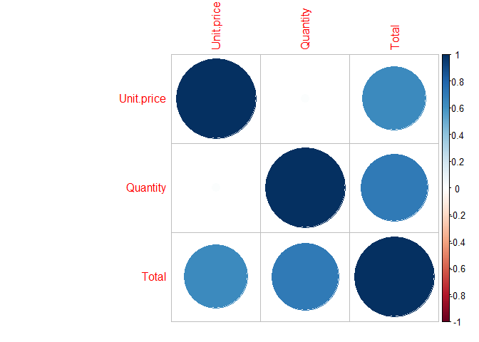

R Notebook
================

# Filter Methods

``` r
data <- read.csv("http://bit.ly/CarreFourDataset")
head(data)
```

    ##    Invoice.ID Branch Customer.type Gender           Product.line Unit.price
    ## 1 750-67-8428      A        Member Female      Health and beauty      74.69
    ## 2 226-31-3081      C        Normal Female Electronic accessories      15.28
    ## 3 631-41-3108      A        Normal   Male     Home and lifestyle      46.33
    ## 4 123-19-1176      A        Member   Male      Health and beauty      58.22
    ## 5 373-73-7910      A        Normal   Male      Sports and travel      86.31
    ## 6 699-14-3026      C        Normal   Male Electronic accessories      85.39
    ##   Quantity     Tax      Date  Time     Payment   cogs gross.margin.percentage
    ## 1        7 26.1415  1/5/2019 13:08     Ewallet 522.83                4.761905
    ## 2        5  3.8200  3/8/2019 10:29        Cash  76.40                4.761905
    ## 3        7 16.2155  3/3/2019 13:23 Credit card 324.31                4.761905
    ## 4        8 23.2880 1/27/2019 20:33     Ewallet 465.76                4.761905
    ## 5        7 30.2085  2/8/2019 10:37     Ewallet 604.17                4.761905
    ## 6        7 29.8865 3/25/2019 18:30     Ewallet 597.73                4.761905
    ##   gross.income Rating    Total
    ## 1      26.1415    9.1 548.9715
    ## 2       3.8200    9.6  80.2200
    ## 3      16.2155    7.4 340.5255
    ## 4      23.2880    8.4 489.0480
    ## 5      30.2085    5.3 634.3785
    ## 6      29.8865    4.1 627.6165

``` r
data = subset(data, select = -c(Invoice.ID) )
```

``` r
library(usethis)
library(devtools)
library(lubridate)
```

    ## 
    ## Attaching package: 'lubridate'

    ## The following objects are masked from 'package:base':
    ## 
    ##     date, intersect, setdiff, union

``` r
data$Date <- mdy(data$Date)
data$Time <- hm(data$Time)
data$hour <- hour(data$Time)
data$day.of.the.week <- wday(data$Date, label = FALSE)
data$day <- mday(data$Date)
data$month <- month(data$Date, label = FALSE)

data = subset(data, select = -c(Time) )
data = subset(data, select = -c(Date) )
```

``` r
# install.packages("CatEncoders")
library(CatEncoders)
```

    ## 
    ## Attaching package: 'CatEncoders'

    ## The following object is masked from 'package:base':
    ## 
    ##     transform

``` r
lenc <- LabelEncoder.fit(data$Payment)
data$Payment <- transform(lenc, data$Payment)
lenc <- LabelEncoder.fit(data$Customer.type)
data$Customer.type <- transform(lenc, data$Customer.type)
lenc <- LabelEncoder.fit(data$Product.line)
data$Product.line <- transform(lenc, data$Product.line)
lenc <- LabelEncoder.fit(data$Branch)
data$Branch <- transform(lenc, data$Branch)
lenc <- LabelEncoder.fit(data$Gender)
data$Gender <- transform(lenc, data$Gender)
```

``` r
colnames(data)
```

    ##  [1] "Branch"                  "Customer.type"          
    ##  [3] "Gender"                  "Product.line"           
    ##  [5] "Unit.price"              "Quantity"               
    ##  [7] "Tax"                     "Payment"                
    ##  [9] "cogs"                    "gross.margin.percentage"
    ## [11] "gross.income"            "Rating"                 
    ## [13] "Total"                   "hour"                   
    ## [15] "day.of.the.week"         "day"                    
    ## [17] "month"

``` r
# install.packages("caret")
library(caret)
```

    ## Loading required package: lattice

    ## Loading required package: ggplot2

``` r
# install.packages("corrplot")
```

``` r
library(corrplot)
```

    ## corrplot 0.84 loaded

``` r
summary(data)
```

    ##      Branch      Customer.type       Gender       Product.line  
    ##  Min.   :1.000   Min.   :1.000   Min.   :1.000   Min.   :1.000  
    ##  1st Qu.:1.000   1st Qu.:1.000   1st Qu.:1.000   1st Qu.:2.000  
    ##  Median :2.000   Median :1.000   Median :1.000   Median :3.000  
    ##  Mean   :1.988   Mean   :1.499   Mean   :1.499   Mean   :3.452  
    ##  3rd Qu.:3.000   3rd Qu.:2.000   3rd Qu.:2.000   3rd Qu.:5.000  
    ##  Max.   :3.000   Max.   :2.000   Max.   :2.000   Max.   :6.000  
    ##    Unit.price       Quantity          Tax             Payment     
    ##  Min.   :10.08   Min.   : 1.00   Min.   : 0.5085   Min.   :1.000  
    ##  1st Qu.:32.88   1st Qu.: 3.00   1st Qu.: 5.9249   1st Qu.:1.000  
    ##  Median :55.23   Median : 5.00   Median :12.0880   Median :2.000  
    ##  Mean   :55.67   Mean   : 5.51   Mean   :15.3794   Mean   :2.001  
    ##  3rd Qu.:77.94   3rd Qu.: 8.00   3rd Qu.:22.4453   3rd Qu.:3.000  
    ##  Max.   :99.96   Max.   :10.00   Max.   :49.6500   Max.   :3.000  
    ##       cogs        gross.margin.percentage  gross.income         Rating      
    ##  Min.   : 10.17   Min.   :4.762           Min.   : 0.5085   Min.   : 4.000  
    ##  1st Qu.:118.50   1st Qu.:4.762           1st Qu.: 5.9249   1st Qu.: 5.500  
    ##  Median :241.76   Median :4.762           Median :12.0880   Median : 7.000  
    ##  Mean   :307.59   Mean   :4.762           Mean   :15.3794   Mean   : 6.973  
    ##  3rd Qu.:448.90   3rd Qu.:4.762           3rd Qu.:22.4453   3rd Qu.: 8.500  
    ##  Max.   :993.00   Max.   :4.762           Max.   :49.6500   Max.   :10.000  
    ##      Total              hour       day.of.the.week      day       
    ##  Min.   :  10.68   Min.   :10.00   Min.   :1.000   Min.   : 1.00  
    ##  1st Qu.: 124.42   1st Qu.:12.00   1st Qu.:2.000   1st Qu.: 8.00  
    ##  Median : 253.85   Median :15.00   Median :4.000   Median :15.00  
    ##  Mean   : 322.97   Mean   :14.91   Mean   :4.101   Mean   :15.26  
    ##  3rd Qu.: 471.35   3rd Qu.:18.00   3rd Qu.:6.000   3rd Qu.:23.00  
    ##  Max.   :1042.65   Max.   :20.00   Max.   :7.000   Max.   :31.00  
    ##      month      
    ##  Min.   :1.000  
    ##  1st Qu.:1.000  
    ##  Median :2.000  
    ##  Mean   :1.993  
    ##  3rd Qu.:3.000  
    ##  Max.   :3.000

``` r
colSums(is.na(data))
```

    ##                  Branch           Customer.type                  Gender 
    ##                       0                       0                       0 
    ##            Product.line              Unit.price                Quantity 
    ##                       0                       0                       0 
    ##                     Tax                 Payment                    cogs 
    ##                       0                       0                       0 
    ## gross.margin.percentage            gross.income                  Rating 
    ##                       0                       0                       0 
    ##                   Total                    hour         day.of.the.week 
    ##                       0                       0                       0 
    ##                     day                   month 
    ##                       0                       0

``` r
data.num <- subset(data, select = -c(Branch, Customer.type, Gender, Product.line, hour, day.of.the.week, day, month, Rating, gross.margin.percentage, Payment) )
head(data.num)
```

    ##   Unit.price Quantity     Tax   cogs gross.income    Total
    ## 1      74.69        7 26.1415 522.83      26.1415 548.9715
    ## 2      15.28        5  3.8200  76.40       3.8200  80.2200
    ## 3      46.33        7 16.2155 324.31      16.2155 340.5255
    ## 4      58.22        8 23.2880 465.76      23.2880 489.0480
    ## 5      86.31        7 30.2085 604.17      30.2085 634.3785
    ## 6      85.39        7 29.8865 597.73      29.8865 627.6165

``` r
normalize <- function(x){
  return ((x-min(x)) / (max(x)-min(x)))
}
```

``` r
for(i in 1:ncol(data.num)) {       # for-loop over columns
  data.num[, i]<- normalize(data.num[, i])
}
```

``` r
correlationMatrix <- cor(data.num)

# Find attributes that are highly correlated
# ---
#
highlyCorrelated <- findCorrelation(correlationMatrix, cutoff=0.75)

# Highly correlated attributes
# ---
# 
highlyCorrelated
```

    ## [1] 3 4 5

``` r
names(data.num[,highlyCorrelated])
```

    ## [1] "Tax"          "cogs"         "gross.income"

``` r
data.num.cor<-data.num[-highlyCorrelated]

# Performing our graphical comparison
# ---
# 
par(mfrow = c(1, 1))
corrplot(correlationMatrix, order = "hclust")
```

<!-- -->

``` r
corrplot(cor(data.num.cor), order = "hclust")
```

<!-- -->
